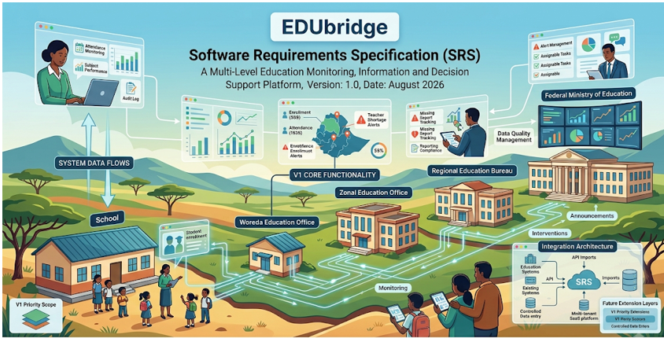

Made by :
             1, Samuel Abera
             2, Yohanes Birhane
             3, Sosna Yeshidnber

Table of Contents
Introduction	2
1.1 Purpose	2
1.2 Background	2
1.4 Proposed Solution	4
1.6 Core Design Principles	6
1.6.1 School-centered operation	6
1.6.2 Education-first design	7
1.6.3 Data generated by normal operations	8
1.6.4 Source-of-truth discipline	8
1.6.5 Role-based access	9
1.6.6 Privacy and minimum necessary access	10
1.6.7 AI as an assistant	11
1.6.8 Integration rather than unnecessary duplication	11
1.6.9 Extensibility	11
1.7 Scope of the System	12
1.8 Out of Scope	13
1.9 Intended Users and Actors	14
1.10 High-Level System Boundary	14
1.11 Expected Outcomes	15
1.12 Relationship to Existing Ethiopian Education Information Systems	16
1.13 Success Criteria	17
2. Overall Description	18
2.1 Product Perspective	18
2.1.1 Education Hierarchy	19
2.1.2 School as the Operational Foundation	20
2.2 Relationship with the Ethiopian Education Ecosystem	21
2.2.1 EduBridge and EMIS	22
2.3 Major Product Functions	22
2.3.1 School Management	22
2.3.2 Student Management	23
2.3.3 Teacher and Staff Management	23
2.3.4 Teaching and Learning	23
2.3.5 Attendance	24
2.3.6 Assessment and Results	24
2.3.7 Student Support	24
2.3.8 Parent and Guardian Engagement	25
2.3.9 Communication	25
2.3.11 Reports and Analytics	26
2.3.12 AI Education Assistance	27
2.4 User Classes and Characteristics	27
2.4.1 Federal Education Users	27
2.4.2 Regional Education Users	28
2.4.3 Zone Education Users	28
2.4.4 Woreda Education Users	28
2.4.5 School Administrator / Principal	29
2.4.6 Academic Leader / Vice Principal	29
2.4.7 Teacher	30
2.4.8 Student	30
2.4.9 Parent / Guardian	31
2.4.10 School Support Staff	31
2.4.11 School Committees	31
2.5 Operating Environment	31
2.6 Organizational Scope and Authorization	32
2.7 Data Flow Perspective	33
2.7.1 Operational Data	34
2.7.2 Aggregated Information	34
2.7.3 External Data	34
2.8 Product Boundaries	35
2.9 Design Principles	35
2.9.1 School-first operational value	36
2.9.2 Hierarchical visibility	36
2.9.3 Source-of-truth preservation	36
2.9.4 Least-privilege access	36
2.9.5 Integration over unnecessary duplication	36
2.9.6 Human responsibility	36
2.9.7 Traceability	36
2.9.8 Data quality	36
2.10 Assumptions and Dependencies	36
2.11 Summary of the Product Perspective	37
3 — System Architecture and Overall Solution	38
3.1 System Overview	38
3.2 High-Level System Structure	39
3.3 Education Administrative Hierarchy	39
3.4 School as the Primary Operational Environment	40
3.5 Operational Data Flow	42
3.6 Bottom-Up Data Flow	43
3.7 Top-Down Information Flow	45
3.8 School-to-Federal and Federal-to-School Relationship	46
3.10 Role-Based Access	47
3.11 AI Architecture	49
3.12 Reporting and Analytics Architecture	50
3.13 System Boundaries	50
3.14 Architectural Principle	51
3.15 Section 3 Summary	52
4 — Stakeholders, Actors, and User Classes	52
4.1 Stakeholder Categories	53
4.2 School-Level Actors	54
4.2.1 School Administrator / Principal	54
4.2.2 Vice Principal / Academic Leader	54
4.2.3 Teacher	55
4.2.4 Student	56
4.2.5 Parent / Guardian	56
4.2.6 School Support Staff	57
4.2.7 School Committee	57
4.3 Woreda Education Users	58
4.4 Zone Education Users	59
4.5 Regional Education Users	59
4.6 Federal / MoE Users	60
4.7 Platform Administrator	60
4.8 External Systems	61
4.9 Actor Access Principle	61
4.10 Actor Authorization Model	62
4.11 Actor Responsibilities vs System Authority	63
4.12 Human Authority Over AI	64
4.14 Section 4 Summary	65
5 — System Functional Requirements	66
5.0 Purpose	66
5.2 Requirement Identification	67
5.3 Requirement Structure	68
5.4 Identity and Authentication Requirements	69
5.4.1 User Identity	69
5.4.2 Authentication	69
5.5 Authorization and Access Control Requirements	70
5.6 School Management Requirements	70
5.7 Academic Year and Academic Organization Requirements	71
5.8 Student Management Requirements	72
5.8.1 Student Registration	72
5.8.2 Enrollment	72
5.8.3 Placement	72
5.8.4 Student Lifecycle	72
5.9 Teacher and School Staff Requirements	73
5.10 Classes, Subjects and Teaching Requirements	73
5.11 Timetable Requirements	74
5.12 Student Attendance Requirements	74
5.13 Teacher Attendance Requirements	75
5.14 Assessment and Results Requirements	75
5.15 Learning Activity Requirements	76
5.16 Learning Resource Requirements	77
5.17 Student Support and Intervention Requirements	77
5.18 Parent / Guardian Requirements	78
5.19 Communication and Notification Requirements	79
5.20 School Improvement Requirements	79
5.21 Reports and Analytics Requirements	80
5.22 AI Education Assistant Requirements	80
5.22.1 General AI	81
5.22.2 Teacher AI	81
5.22.3 Student AI	81
5.22.4 Parent AI	82
5.22.5 School Leadership AI	82
5.22.6 AI Safety and Authority	82
5.23 Administrative-Level Monitoring Requirements	82
5.24 Hierarchical Data Flow Requirements	84
Bottom-Up Flow	84
Top-Down Flow	84
5.25 External System Integration Requirements	85
5.26 File and Document Management Requirements	86
5.27 Audit and Traceability Requirements	86
5.28 Cross-Functional Requirements for All Functional Operations	86
5.29 Source-of-Truth Functional Principles	87
5.30 Functional Requirement Traceability	88
5.31 Functional Scope Boundary	90
5.33 Section 5 Summary	90
6 — Non-Functional Requirements	91
6.1 Performance	91
6.2 Availability and Reliability	92
6.3 Security	92
6.4 Privacy and Data Protection	92
6.5 Scalability	93
6.6 Usability and Accessibility	93
6.7 Maintainability	94
6.8 Interoperability	94
6.9 Data Integrity	94
6.10 Auditability and Observability	95
6.11 AI Safety and Reliability	95
6.12 Portability and Deployment	95
6.13 NFR Quality Principle	95
7 — System Interfaces & External Integrations	96
7.1 Internal System Interfaces	96
7.2 Government / Education System Integration	97
7.3 Learning Platform Integration	97
7.4 Notification Interfaces	97
7.5 Identity Interfaces	98
7.6 Data Exchange Requirements	98
7.7 Integration Security	98
7.8 Integration Principle	98
8 — Data Requirements	99
8.1 Data Categories	99
8.2 Data Ownership	100
8.3 Data Relationships	100
8.4 Historical Data	100
8.5 Data Quality	101
8.6 Data Privacy and Access	101
8.7 Hierarchical Data	101
8.8 AI Data	102
9 — System Architecture & Technical Design	102
9.1 Architecture Overview	102
9.2 Domain-Based Design	103
9.3 Data Architecture	103
9.4 AI Architecture	104
9.5 Integration Architecture	104
9.6 Architectural Principles	105
Section 10 — External Interface Requirements	105
11 — Security & Privacy Requirements	108
11.1 Purpose	108
11.2 Authentication	108
11.3 Authorization	108
11.4 Data Protection	108
11.5 Privacy	108
11.6 Audit and Accountability	109
11.7 Data Integrity	109
11.8 AI Privacy and Security	109
11.9 Administrative Data Isolation	110
11.10 Security Principle	110
12 — Verification, Validation & Acceptance Requirements	110
12.1 Requirement Verification	110
12.2 Functional Verification	110
12.3 Acceptance Criteria	111
12.4 Security Verification	111
12.5 Data Verification	111
12.6 AI Verification	111
12.7 Traceability	112
12.8 Final Acceptance Principle	112
13 — SRS Conclusion & Approval	112

 
Introduction
1.1 Purpose
EduBridge is a comprehensive education technology platform designed to support the day-to-day operation of schools while creating a structured, reliable, and traceable education information environment that can support decision-making across Ethiopia's education hierarchy.
The platform is designed around a fundamental principle:
Schools should be able to perform their normal educational and administrative activities through EduBridge, while the data naturally produced by those activities can support authorized reporting, monitoring, analysis, and decision-making at higher administrative levels.
EduBridge is therefore not primarily a system for sending reports from schools to the Federal Ministry. It is a school-centered operational platform whose data can subsequently support the wider education ecosystem.
The platform will support activities including student enrollment and management, teacher and staff management, classes and teaching, attendance, assessment, learning activities, student support, parent engagement, communication, school improvement, reporting and analytics, learning resources, and AI-assisted educational services.
The platform will also provide appropriate administrative and authorization mechanisms so that different actors can access only the information and functions relevant to their responsibilities.
1.2 Background
Ethiopia's education system operates through multiple administrative levels, including federal, regional, zone, woreda, and school levels. The Ministry of Education's education-sector planning documents recognize the importance of education management information systems, integrated education data, and information structures operating across these levels.
Existing Ministry systems already collect and manage important education information, including information related to schools, students, teachers, and education administration.
EduBridge is designed with this existing ecosystem in mind.
It is not intended to replace the Ethiopian Ministry of Education's EMIS or other authoritative government systems.
Instead, EduBridge should provide a modern operational environment at the school level and, where authorized and technically appropriate, integrate with existing government systems.
The central idea is:

 

The school is therefore the primary operational environment of EduBridge.
1.3 Problem Statement
Many education activities generate valuable information every day:
	Students enroll and change status. 
	Students are assigned to grades and sections. 
	Teachers teach subjects and classes. 
	Teachers record attendance. 
	Teachers conduct assessments. 
	Students complete learning activities. 
	Teachers provide feedback. 
	Schools identify students requiring support. 
	Parents communicate with schools. 
	Schools develop improvement plans. 
	School leaders monitor academic and operational performance. 
When these activities are handled through fragmented, disconnected, or largely manual processes, several problems can occur:
	Student information can become duplicated or inconsistent. 
	Attendance information can be difficult to monitor over time. 
	Assessment information can be fragmented across teachers and classes. 
	School leaders may lack timely visibility into school performance. 
	Parents may have limited visibility into their children's education. 
	Teachers may spend unnecessary time on repetitive administrative work. 
	Student support may depend heavily on manual identification. 
	School improvement activities may be difficult to track. 
	Education information may require repeated manual compilation. 
	Data required by higher education authorities may be incomplete, delayed, or difficult to aggregate. 
	Existing government information systems may not receive sufficiently structured operational data. 
	Educational decisions may be made without timely access to reliable school-level information. 
EduBridge addresses these problems by connecting normal school operations within a unified platform.
1.4 Proposed Solution
EduBridge shall provide a unified digital platform through which authorized school actors can perform their normal responsibilities.
The platform shall support:
 

The data generated by these activities becomes structured school information.
That information can then support:
 This creates a bottom-up information flow without making reporting the primary purpose of the school platform.
1.5 Vision
The long-term vision of EduBridge is to provide an integrated digital education environment in which:
Students learn, teachers teach, parents participate, schools manage their operations, and education authorities receive reliable information from the normal operation of the education system.
EduBridge should progressively become a platform that connects the education ecosystem while respecting the responsibilities of existing educational institutions and government systems.
1.6 Core Design Principles
1.6.1 School-centered operation
The school is the primary operational environment.
EduBridge shall first solve real problems experienced by:
	School administrators 
	Academic leaders 
	Teachers 
	Students 
	Parents/guardians 
	School support staff 
	School committees where applicable 
Higher-level reporting shall be derived from legitimate school operations rather than forcing schools to maintain a separate reporting system solely for higher authorities.
1.6.2 Education-first design
EduBridge shall be designed around real educational processes rather than around database tables or government reporting forms.
The system should model what schools actually do:
 
1.6.3 Data generated by normal operations
Where possible, information required for reporting and analysis should be generated automatically from normal school activities.
For example:
 
The teacher should not be required to enter the same information again solely because a higher administrative level needs it.
1.6.4 Source-of-truth discipline
EduBridge shall clearly distinguish between:
	Authoritative operational records 
	Derived statistics 
	Analytical indicators 
	AI-generated insights 
	External government information 
For example:
 
1.6.5 Role-based access
EduBridge shall enforce role-based and scope-based authorization.
A user's access shall depend on:
	Their role. 
	Their organization/school. 
	Their responsibilities. 
	The type of information being accessed. 
For example:
 
No actor should automatically have unrestricted access merely because they have an administrative role.
1.6.6 Privacy and minimum necessary access
Student, teacher, parent, and other personal information shall be protected.
EduBridge shall follow the principle that users should access only the information necessary for their legitimate responsibilities.
Sensitive information shall not be exposed simply because it exists in the system.

1.6.7 AI as an assistant
AI is a supporting capability, not an authority over education records.
AI may:
	Analyze information. 
	Summarize information. 
	Identify patterns. 
	Assist teachers. 
	Assist students. 
	Assist parents. 
	Assist school leaders. 
	Recommend interventions. 
	Provide early-warning indicators. 
	Support natural-language analytics. 
AI shall not independently:
	Change official grades. 
	Change attendance records. 
	Change enrollment status. 
	Approve student promotion. 
	Issue examination results. 
	Make official education-policy decisions. 
	Replace teachers or authorized education officials. 
Human actors remain responsible for authoritative educational decisions.
1.6.8 Integration rather than unnecessary duplication
EduBridge shall recognize existing government education information systems and other authorized systems.
Where an authoritative external system already provides a required identity or dataset, EduBridge should support appropriate integration or synchronization rather than unnecessarily creating a competing authoritative source.
1.6.9 Extensibility
EduBridge shall be designed so that additional education functions can be added without fundamentally redesigning the platform.
The architecture should support future expansion toward:
	Additional schools. 
	Additional regions. 
	Additional education programs. 
	Government integrations. 
	Learning-resource integrations. 
	Advanced analytics. 
	AI capabilities. 
	Additional education actors. 
	Additional administrative levels. 
1.7 Scope of the System
The initial EduBridge scope includes the School Domain as the primary operational domain.
The School Domain includes:
 
The wider EduBridge architecture may later include:
Federal
   │
Regional
   │
Zone
   │
Woreda
   │
School
However, these higher administrative domains shall be developed according to their own responsibilities and requirements.
1.8 Out of Scope
The initial EduBridge platform shall not attempt to replace:
	The Federal Ministry of Education. 
	National education policy systems. 
	The national EMIS as an authoritative government system. 
	National examination authorities. 
	National curriculum-authoring systems. 
	Government payroll systems. 
	Government HR systems. 
	Government financial-management systems. 
	Other authoritative government systems. 
EduBridge may integrate with such systems where appropriate and authorized.

1.9 Intended Users and Actors
The initial School Domain recognizes the following primary actors:
Actor	Primary responsibility in EduBridge
School Administrator / Principal	Manage and oversee school operations
Vice Principal / Academic Leader	Monitor academic and teaching operations
Teacher	Teach, assess, record attendance and support students
Student	Learn, participate in activities and monitor progress
Parent / Guardian	Monitor and support the child's education
School Support Staff	Perform authorized operational/support activities
School Committees	Participate in governance and school improvement where applicable

The platform also has a separate EduBridge Platform Administrator responsible for operating the software platform itself.
The Platform Administrator is not an education authority and does not manage the educational decisions of schools.
1.10 High-Level System Boundary
The system can be viewed as:
 
1.11 Expected Outcomes
EduBridge is intended to produce the following outcomes:
For schools
	More organized school operations. 
	Reduced repetitive administrative work. 
	Better visibility into school activities. 
	Better student information management. 
	Better attendance monitoring. 
	Better assessment management. 
	Better student-support workflows. 
	Better school-improvement tracking. 
For teachers
	Easier management of classes. 
	Easier attendance recording. 
	Easier assessment and gradebook management. 
	Learning-activity support. 
	Student-progress visibility. 
	AI-assisted teaching and administrative support. 
For students
	Access to learning activities. 
	Access to educational resources. 
	Visibility into their progress. 
	Participation in assessments and assignments. 
	Access to appropriate AI learning assistance. 
	Better access to support. 
For parents/guardians
	Visibility into children's education. 
	Attendance information. 
	Academic progress information. 
	School/teacher communication. 
	Notifications and participation opportunities. 
For school leadership
	School-wide operational visibility. 
	Academic monitoring. 
	Attendance monitoring. 
	Student-support monitoring. 
	School-improvement management. 
	Data-driven decision support. 
For education authorities
Where authorized and integrated, EduBridge can provide structured and more timely school-level information that can support:
	Monitoring. 
	Aggregation. 
	Planning. 
	Analysis. 
	Education-sector decision-making. 
1.12 Relationship to Existing Ethiopian Education Information Systems
EduBridge shall be designed to coexist with Ethiopia's existing education information environment.
The platform should recognize that government systems may already be authoritative for certain information, particularly:
	School identifiers. 
	Education administrative hierarchy. 
	Education statistics. 
	Teacher information. 
	Student information. 
	Other government-managed education datasets. 
Therefore, EduBridge shall distinguish between:
 
1.13 Success Criteria
EduBridge will be considered successful when a school can use the platform as part of its normal daily operation rather than treating it as a separate reporting application.
At a high level:
 
The core success principle is:
The information required by the wider education ecosystem should emerge naturally from a well-designed school operating system.

2. Overall Description
2.1 Product Perspective
EduBridge is a multi-level education management and learning platform designed to support the normal operation of schools while enabling authorized education stakeholders to access structured information at the appropriate administrative level.
EduBridge is not intended to replace the Ethiopian Ministry of Education's existing national education information systems. The Ethiopian education-sector strategy identifies EMIS as an important education data-management structure and calls for integrated school, teacher, and student identifiers, with EMIS structures operating at MoE, regional, woreda, and school levels. 
EduBridge therefore follows the principle:
Schools generate operational education data through normal educational activities; authorized higher-level users can use appropriately aggregated and scoped information for monitoring, planning, reporting, and decision-making.
The platform should support integration with existing government systems where appropriate rather than unnecessarily duplicating their responsibilities.
2.1.1 Education Hierarchy
The high-level organizational model is:
 
The hierarchy represents scope and authority, not simply a technical data-transfer pipeline.
A user at a higher administrative level shall be able to access information only within the scope authorized for that level.
For example:
	A school user operates within the school. 
	A Woreda user can monitor authorized schools within the Woreda. 
	A Zone user can monitor authorized Woredas within the Zone. 
	A Regional user can monitor authorized Zones within the Region. 
	A Federal user can access authorized national-level information. 
The reverse direction is also supported conceptually:
 
Higher-level information may include authorized policies, targets, programs, notifications, reporting requirements, approved configurations, resources, and feedback.
2.1.2 School as the Operational Foundation
The school is the primary operational environment of EduBridge.
Schools use the platform to perform normal activities such as:
 
The data generated by these activities can subsequently support authorized reporting and aggregation at higher administrative levels.
EduBridge therefore does not require schools to operate the system merely as a data-submission tool.
The platform should provide direct operational value to schools, teachers, students, and parents.

2.2 Relationship with the Ethiopian Education Ecosystem
EduBridge is designed to operate within the existing Ethiopian education ecosystem.
The current Ministry organizational structure includes distinct functions for:
	EMIS and ICT 
	General Education 
	Curriculum Development 
	Teachers' and Educational Leaders' Development 
	Educational Program and Quality Improvement 
	General Education Inspection 
	ICT and Digital Education 
	Education Assessment and Examination 
	Other education-sector functions. 
EduBridge shall therefore avoid treating the entire education system as one undifferentiated administrative function.
Instead, responsibilities shall remain separated according to organizational scope and system responsibility.
2.2.1 EduBridge and EMIS
EduBridge shall be capable of producing structured education information that can support authorized education reporting and integration.
EduBridge shall not be defined as a replacement for the national EMIS.
Where an existing government system is authoritative for a particular dataset or function, EduBridge should support appropriate integration, synchronization, import, export, or reporting mechanisms rather than independently redefining the authoritative source.
The ESDP VI specifically identifies:
	integrated data management using school, teacher, and student identifiers; 
	EMIS structures at MoE, regional, woreda, and school levels; 
	integration of EMIS with GIS, SMIS, and TMIS; 
	improved education data collection and management; 
	dissemination and analysis of education data for planning and decision-making. 
These principles are important architectural considerations for EduBridge.
2.3 Major Product Functions
At a high level, EduBridge shall provide the following functional areas.
2.3.1 School Management
EduBridge shall support:
	School profile management. 
	Academic-year management. 
	Grade management. 
	Section/class management. 
	Subject management. 
	School timetable management. 
	School user and role management. 
	School operational oversight. 
2.3.2 Student Management
EduBridge shall support:
	Student registration. 
	Student enrollment. 
	Student profiles. 
	Class and section placement. 
	Student status management. 
	Student transfers. 
	Student history. 
	Student documents. 
	Student academic records. 
2.3.3 Teacher and Staff Management
EduBridge shall support:
	Teacher profiles. 
	School staff profiles. 
	Teaching assignments. 
	Teacher workload information. 
	Teacher attendance. 
	Professional-development records. 
	Teacher qualifications/certifications where applicable. 
2.3.4 Teaching and Learning
EduBridge shall support:
	Subjects. 
	Teaching assignments. 
	Classes. 
	Sections. 
	Timetables. 
	Curriculum-progress tracking. 
	Learning activities. 
	Learning resources. 
	Student submissions. 
	Teacher feedback. 
2.3.5 Attendance
EduBridge shall support:
	Student attendance. 
	Teacher attendance. 
	Daily attendance. 
	Lesson-level attendance where applicable. 
	Attendance history. 
	Absence reasons. 
	Attendance explanations. 
	Attendance corrections. 
	Attendance alerts. 
2.3.6 Assessment and Results
EduBridge shall support:
	Assessments. 
	Tests. 
	Quizzes. 
	Assignments used for assessment. 
	Projects. 
	Practical assessments. 
	Assessment results. 
	Gradebooks. 
	Reporting periods. 
	Student results. 
	Teacher feedback. 
	Performance trends. 
EduBridge may manage school-level assessment information but shall not become the authoritative authority for national examination results.
2.3.7 Student Support
EduBridge shall support:
	Identification of students requiring support. 
	Learning-difficulty records where appropriate. 
	Remedial support. 
	Enrichment activities. 
	Intervention plans. 
	Intervention sessions. 
	Intervention monitoring. 
	Intervention outcomes. 
AI-generated indicators shall support human review and intervention rather than automatically becoming official student classifications.
2.3.8 Parent and Guardian Engagement
EduBridge shall support:
	Parent/guardian profiles. 
	Student-parent relationships. 
	Parent notifications. 
	Parent-teacher communication. 
	Parent meetings. 
	Access to authorized student information. 
	Participation in appropriate student-support processes. 
2.3.9 Communication
EduBridge shall support:
	School announcements. 
	Teacher communication. 
	Student communication. 
	Parent communication. 
	In-app notifications. 
	SMS/email/push integration where available. 
	Notification preferences. 
	Notification delivery tracking. 
Communication shall always respect the user's organizational and relationship-based authorization.
2.3.10 School Improvement
EduBridge shall support:
	Identification of school problems. 
	Improvement priorities. 
	Improvement plans. 
	Improvement activities. 
	Improvement targets. 
	Progress monitoring. 
	Outcome tracking. 
School improvement information shall remain distinct from ordinary student academic records.
2.3.11 Reports and Analytics
EduBridge shall provide authorized reporting and analytics for:
	Enrollment. 
	Attendance. 
	Teacher statistics. 
	Assessment. 
	Student performance. 
	Curriculum progress. 
	Student support. 
	School performance. 
	School activity. 
	Other approved education indicators. 
Higher-level dashboards shall aggregate information according to organizational scope.
For example:
School data
    ↓
Woreda aggregation
    ↓
Zone aggregation
    ↓
Regional aggregation
    ↓
Federal aggregation
The system shall preserve the underlying source records and distinguish calculated/aggregated indicators from authoritative transactional records.
2.3.12 AI Education Assistance
AI shall operate as a supporting capability across EduBridge, rather than as an independent authority.
AI capabilities may include:
	Teacher AI assistance. 
	Student learning assistance. 
	Parent assistance. 
	School leadership assistance. 
	Natural-language analytics. 
	Performance analysis. 
	Early-warning indicators. 
	Intervention recommendations. 
	Learning recommendations. 
	Administrative assistance. 
AI shall not independently modify authoritative education records such as:
	Student enrollment. 
	Attendance. 
	Assessment results. 
	Official grades. 
	Promotion status. 
	Examination results. 
	Other protected records. 
Human authorization shall remain required for authoritative decisions.
2.4 User Classes and Characteristics
EduBridge shall support multiple user classes.
2.4.1 Federal Education Users
Federal users operate at the national level within their authorized responsibilities.
They may require:
	National-level dashboards. 
	Aggregated education indicators. 
	Cross-regional comparisons. 
	National reporting. 
	Policy and program monitoring. 
	Authorized drill-down into lower administrative levels. 
	Data-quality monitoring. 
	Integration with relevant national systems. 
The Ministry's organizational structure separates functions such as EMIS/ICT, general education, curriculum, teacher development, quality improvement, inspection, and assessment/examination. EduBridge shall therefore use appropriate permissions rather than assuming every federal user has unrestricted access. 
2.4.2 Regional Education Users
Regional users shall operate within their regional scope.
They may require:
	Regional dashboards. 
	School and Woreda aggregation. 
	Regional performance monitoring. 
	Regional reporting. 
	Data-quality monitoring. 
	Authorized drill-down to Woreda and school level. 
	Regional program monitoring. 
2.4.3 Zone Education Users
Zone users shall operate within their Zone scope.
They may require:
	Zone dashboards. 
	Woreda comparison. 
	School aggregation. 
	Attendance monitoring. 
	Enrollment monitoring. 
	Assessment monitoring. 
	School-support monitoring. 
	Authorized drill-down to Woreda and school level. 
2.4.4 Woreda Education Users
Woreda users shall operate within their Woreda scope.
They may require:
	Woreda dashboards. 
	School monitoring. 
	Enrollment monitoring. 
	Attendance monitoring. 
	Teacher/student statistics. 
	Assessment monitoring. 
	School-support monitoring. 
	Data-quality monitoring. 
	Authorized school-level drill-down. 
2.4.5 School Administrator / Principal
The School Administrator is responsible for operational management of the school.
They shall be able to:
	Manage school information. 
	Manage academic configuration. 
	Manage users and school roles. 
	Manage students. 
	Manage teachers and staff. 
	Oversee attendance. 
	Oversee assessment. 
	Monitor school performance. 
	Manage communication. 
	Manage school improvement. 
	Access school reports and analytics. 
They shall not have authority to modify national education policy or higher-level government records merely because they administer the school.
2.4.6 Academic Leader / Vice Principal
The Academic Leader shall focus on academic and teaching operations.
They shall be able to:
	Monitor teaching assignments. 
	Monitor timetable implementation. 
	Monitor attendance. 
	Monitor curriculum progress. 
	Monitor assessment. 
	Review student performance. 
	Identify students requiring support. 
	Coordinate academic interventions. 
	Support teachers. 
	Use academic analytics and AI assistance. 
2.4.7 Teacher
Teachers shall use EduBridge primarily for teaching and student support.
They shall be able to:
	Access assigned classes. 
	Access assigned subjects. 
	Record attendance. 
	Create learning activities. 
	Create assignments. 
	Create quizzes. 
	Create assessments. 
	Record results. 
	Provide feedback. 
	Monitor student progress. 
	Identify students requiring support. 
	Communicate with authorized students/parents. 
	Use teacher AI assistance. 
2.4.8 Student
Students shall use EduBridge primarily for learning.
They shall be able to:
	View their classes. 
	View their timetable. 
	View learning activities. 
	Complete assignments. 
	Complete quizzes. 
	Submit work. 
	View authorized results. 
	Receive teacher feedback. 
	Access approved learning resources. 
	Monitor their own progress. 
	Receive appropriate support. 
	Use the student AI assistant. 
2.4.9 Parent / Guardian
Parents/guardians shall use EduBridge to participate in their child's education.
They shall be able to:
	View authorized child information. 
	Monitor attendance. 
	View authorized academic progress. 
	Receive notifications. 
	Communicate with teachers/school. 
	Participate in meetings. 
	Receive support/intervention-related communication where appropriate. 
	Use parent AI assistance. 
A parent shall not automatically receive access to information belonging to another student.
2.4.10 School Support Staff
Support staff shall receive only the permissions necessary for their assigned operational responsibilities.
Their access shall be configurable according to the school and their role.
2.4.11 School Committees
School committees may participate in appropriate school-governance and improvement activities.
Their access shall be limited to information and functions explicitly authorized for the committee role.
A committee member shall not automatically receive the same access as a School Administrator.
2.5 Operating Environment
EduBridge shall operate as a modern distributed software platform.
At a high level, the environment shall include:
 
The final technical architecture shall be defined separately from this high-level SRS description.
The current implementation direction uses PostgreSQL and Prisma as the database access/ORM technology, but the SRS shall remain primarily technology-independent where the requirement does not depend on a specific implementation.

2.6 Organizational Scope and Authorization
EduBridge shall implement organizational scope.
A user's access shall be determined by both:
1.	Role 
2.	Organizational scope 
For example:
Role: Teacher
Scope: School A
does not provide access to students or classes belonging to School B.
Similarly:
Role: Woreda Officer
Scope: Woreda X
does not automatically provide access to Woreda Y.
Higher-level users may receive broader scope according to their authorized responsibilities.
The system shall support controlled drill-down:
 
where the user's authorization permits the operation.
2.7 Data Flow Perspective
EduBridge shall distinguish between operational data, aggregated information, and external authoritative data.
2.7.1 Operational Data
Operational data originates from normal school activities.
Examples include:
	Student enrollment. 
	Student attendance. 
	Teacher attendance. 
	Teaching assignments. 
	Assessments. 
	Results. 
	Learning activities. 
	Student support. 
	Parent communication. 
2.7.2 Aggregated Information
Operational data may be transformed into authorized indicators.
For example:
 
Aggregation shall preserve the relationship between the indicator and its source data.
2.7.3 External Data
EduBridge may consume or exchange data with external systems when authorized.
Potential integration categories include:
	EMIS. 
	GIS. 
	School information systems. 
	Teacher information systems. 
	Student information systems. 
	Learning platforms. 
	Notification providers. 
	Other authorized government systems. 
The ESDP VI explicitly identifies integration of EMIS with GIS, SMIS, and TMIS as a strategic direction. 
2.8 Product Boundaries
EduBridge shall not automatically become the owner of every education-sector function.
The following are outside the core School-domain responsibility unless a specific future requirement is approved:
	National education policy creation. 
	National curriculum authoring. 
	National examination administration. 
	Government payroll. 
	Government HR management. 
	Government financial management. 
	National EMIS replacement. 
	Full national LMS replacement. 
	Government procurement. 
	Other unrelated government administrative systems. 
EduBridge may integrate with such systems where appropriate.
The Ministry currently maintains separate organizational functions and sector institutions for education assessment/examinations and other responsibilities, reinforcing the importance of maintaining these boundaries. 
2.9 Design Principles
The following principles shall guide the system.
2.9.1 School-first operational value
EduBridge shall provide direct value to schools rather than functioning only as a reporting mechanism.
2.9.2 Hierarchical visibility
Information shall be available according to authorized organizational scope.
2.9.3 Source-of-truth preservation
Operational records shall remain distinguishable from derived reports and analytics.
2.9.4 Least-privilege access
Users shall receive only the permissions necessary for their responsibilities.
2.9.5 Integration over unnecessary duplication
Existing authoritative systems should be integrated where appropriate.
2.9.6 Human responsibility
AI shall assist people but shall not silently replace authorized educational decisions.
2.9.7 Traceability
Important changes to education records shall be auditable.
2.9.8 Data quality
The platform shall support validation, completeness monitoring, duplicate detection, and data-quality improvement.
This aligns with the ESDP VI emphasis on improving education data collection, management, reliability, and use for planning and decision-making. 
2.10 Assumptions and Dependencies
The system design assumes:
	Schools have authorized users who can operate EduBridge. 
	Users are assigned appropriate organizational roles and scopes. 
	Education organizations maintain identifiable administrative structures. 
	School, teacher, and student identities can be represented consistently. 
	External government-system integrations will be subject to authorization and technical availability. 
	Internet/connectivity conditions may vary between schools. 
	Some schools may have existing records that require migration or integration. 
	Education data may require multilingual support. 
	Higher-level reporting depends on the completeness and quality of lower-level operational data. 
The system shall therefore be designed so that temporary connectivity limitations, incomplete data, integration failures, and other operational problems can be handled without silently corrupting authoritative records.
2.11 Summary of the Product Perspective
EduBridge can be summarized as:
 
The central concept is:
EduBridge connects everyday school operations with authorized education-system visibility without turning the platform into a replacement for the Ministry's existing institutions or national systems.

3 — System Architecture and Overall Solution
3.1 System Overview
EduBridge is a hierarchical, multi-level education platform designed to support educational institutions and education-management authorities through a connected ecosystem.
The system begins at the school level, where students, teachers, parents/guardians, school leaders, and support personnel perform their normal educational and administrative activities.
The information generated through these activities becomes structured educational data that can subsequently support higher-level monitoring, analysis, planning, and decision-making.
The system shall therefore distinguish between:
	Operational activities — what users actually do. 
	Operational records — data produced by those activities. 
	Analytics and reports — information derived from operational records. 
	Administrative hierarchy — the organizational levels through which education is managed. 
	AI assistance — intelligence applied to approved data to assist users.
3.2 High-Level System Structure
 

3.3 Education Administrative Hierarchy
EduBridge shall support the education-management hierarchy relevant to the Ethiopian education system.
Conceptually:
 
The exact administrative structure may vary by location and administrative arrangement; therefore, the system shall support configurable geographic/organizational relationships rather than assuming that every location has an identical structure.
The Ministry itself identifies EMIS and ICT as part of its organizational structure and describes information-system support extending across regional, zone, district, and school levels.
3.4 School as the Primary Operational Environment
The school is the primary operational environment of the initial EduBridge implementation.
The school shall be able to conduct its ordinary activities through EduBridge.
 
EduBridge shall not require school personnel to enter data merely for the purpose of producing federal reports.
Instead:

 
3.5 Operational Data Flow
EduBridge shall treat operational records as the primary source of educational information.
For example:
 
The system should therefore avoid creating separate manual datasets solely for reporting purposes whenever the required information can be derived from operational records.
This is consistent with the broader MoE objective of moving toward a data-driven education system and producing reliable and timely education statistics at different levels. 

3.6 Bottom-Up Data Flow
EduBridge shall support a bottom-up information flow.
 
The lower level shall remain the primary producer of many operational records.
Higher levels shall primarily consume appropriately authorized information for:
•	Monitoring 
•	Planning 
•	Analysis 
•	Resource planning 
•	Performance monitoring 
•	Policy support 
•	Education-sector reporting 
EduBridge shall not assume that every raw school record must be exposed to every higher-level user.
Access shall be controlled according to organizational scope and authorization.
3.7 Top-Down Information Flow
The system shall also support authorized information and configuration flowing downward.
 
Depending on the relevant functionality, higher levels may provide or publish:
•	Policies 
•	Standards 
•	Approved configurations 
•	Educational guidance 
•	Reporting requirements 
•	Reference information 
•	Authorized programs 
•	Educational resources 
•	System-level notifications 
However, EduBridge shall distinguish between:
Government authority
and
EduBridge platform functionality.
EduBridge does not automatically become the legal authority for national education policy or examination decisions.

3.8 School-to-Federal and Federal-to-School Relationship
The complete conceptual relationship is therefore:
 
The arrows represent authorized information and service relationships, not necessarily unrestricted bidirectional database access.
This architecture allows EduBridge to grow from a school-management platform into a broader education information ecosystem without forcing all layers to share the same operational responsibilities.

3.9 Core School Actors
The School domain shall support the following approved actors:
Actor	Primary responsibility
School Administrator / Principal	School operational management and oversight
Vice Principal / Academic Leader	Academic and teaching oversight
Teacher	Teaching, attendance, assessment and student support
Student	Learning and participation
Parent / Guardian	Monitoring and supporting the learner
School Support Staff	Assigned operational/support activities
School Committees	Governance, participation and school improvement

Each actor shall receive access according to their responsibilities.
3.10 Role-Based Access
EduBridge shall use role-based and scope-based authorization.
Conceptually:
 
For example:
Teacher
   │
   ├── Own classes
   ├── Assigned subjects
   ├── Assigned students
   └── Relevant parents
while:
Principal
   │
   └── Entire school
and:
Woreda user
   │
   └── Authorized schools within woreda
The system shall prevent users from accessing information outside their authorized organizational and functional scope.
3.11 AI Architecture
AI shall be implemented as a supporting capability, not as an independent source of official educational truth.
 
AI may assist with:
	Teaching preparation 
	Learning support 
	Student progress analysis 
	Early-warning indicators 
	Intervention recommendations 
	School performance analysis 
	Natural-language analytics 
	Parent assistance 
	Administrative assistance 
AI shall not independently modify authoritative records such as:
	Student enrollment 
	Attendance 
	Assessment results 
	Official grades 
	Promotion decisions 
	Transfers 
	Examination results 
unless an authorized human workflow explicitly approves the action.
3.12 Reporting and Analytics Architecture
Reporting shall primarily derive information from operational records.
 
This approach supports the MoE objective of reliable, timely and usable education information at macro and micro levels.
3.13 System Boundaries
EduBridge shall initially focus on:
 
3.14 Architectural Principle
The fundamental architectural principle is:
Capture data once through normal educational work, maintain it as authoritative operational data, and derive the appropriate information for users and education-management levels from that data.
Therefore:
 
3.15 Section 3 Summary
EduBridge shall be designed as a connected education platform whose school level is the primary operational foundation, while supporting authorized interaction with higher education-management levels.
The architecture shall:
	Support normal school operations. 
	Maintain structured operational education records. 
	Preserve authoritative source data. 
	Support school-level analytics. 
	Support authorized bottom-up aggregation. 
	Support authorized top-down information and services. 
	Enforce organizational data boundaries. 
	Provide role-based access. 
	Provide AI assistance without replacing human authority. 
	Allow future integration with government and education systems. 
	Avoid unnecessary duplication of authoritative external systems. 
4 — Stakeholders, Actors, and User Classes
This section defines who interacts with EduBridge, why they use it, what level of responsibility they have, and the boundaries of their interaction.
This is important before writing detailed functional requirements because requirements should be traceable to stakeholder and user needs. ISO/IEC/IEEE 29148 treats stakeholder needs and requirements engineering as the foundation for subsequent system requirements and design. 
For EduBridge, we will preserve the actors we already approved in the School domain and extend the same hierarchical thinking to the wider education-management system.
4.1 Stakeholder Categories
EduBridge stakeholders are divided into five major groups:
 
4.2 School-Level Actors
The school is the primary operational environment of EduBridge.
The following school actors have already been approved as part of the School domain.
4.2.1 School Administrator / Principal
The Principal is responsible for the overall operation and management of the school.
The Principal shall be able to:
	Manage the school's operational information. 
	Manage school academic-year configuration. 
	Oversee students. 
	Oversee teachers and staff. 
	Oversee classes and sections. 
	Oversee subjects and teaching assignments. 
	Monitor attendance. 
	Monitor assessments and results. 
	Monitor curriculum/teaching progress. 
	Monitor student-support activities. 
	Manage school communication. 
	Monitor school performance. 
	Manage school-improvement activities. 
	Review school reports and analytics. 
	Access AI-assisted school-level analysis. 
	Review important alerts and recommendations. 
	Manage appropriate school-level users and permissions. 
The Principal shall primarily operate within the school scope.
The Principal shall not automatically have authority over regional, woreda, zone, or federal records.
4.2.2 Vice Principal / Academic Leader
The Academic Leader is responsible primarily for academic and teaching oversight.
The Academic Leader shall be able to:
	Monitor teacher teaching activities. 
	Monitor teaching assignments. 
	Monitor classes and sections. 
	Monitor timetable implementation. 
	Monitor curriculum progress. 
	Monitor student attendance. 
	Review assessment activities. 
	Review student performance. 
	Identify students requiring academic support. 
	Monitor remedial and enrichment activities. 
	Support teachers with academic planning. 
	Review teacher workload. 
	Review academic reports. 
	Generate academic analytics. 
	Use AI assistance for academic analysis. 
	Receive AI-generated academic insights and recommendations. 
	Support school improvement related to teaching and learning. 
The Academic Leader shall have broader academic visibility than an individual teacher but shall remain within the school's authorized scope.
4.2.3 Teacher
The Teacher is one of the primary operational users of EduBridge.
The Teacher shall be able to:
	View assigned subjects. 
	View assigned grades and sections. 
	View assigned students. 
	View teaching timetable. 
	Manage learning activities. 
	Create assignments. 
	Create quizzes. 
	Create tests and other assessments. 
	Record assessment results. 
	Maintain relevant gradebook information. 
	Record student attendance. 
	Review attendance history for assigned students. 
	Provide student feedback. 
	Monitor student learning progress. 
	Identify students requiring support. 
	Participate in intervention activities. 
	Provide remedial learning. 
	Provide enrichment activities. 
	Upload or reference learning resources. 
	Communicate with students. 
	Communicate with relevant parents/guardians. 
	Participate in parent meetings. 
	Review academic analytics relevant to assigned classes. 
	Use the Teacher AI Assistant. 
	Generate lesson/learning assistance through AI. 
	Request AI-generated learning activities. 
	Request AI-assisted assessment preparation. 
	Analyze student/class performance using AI. 
	Receive AI-generated student-support suggestions. 
	Review and approve any AI-generated educational output before official use. 
The Teacher shall not modify records outside the teacher's authorized classes, subjects, students, or responsibilities.
4.2.4 Student
The Student is a direct learner and participant in the education process.
The Student shall be able to:
	View their profile information. 
	View enrollment information. 
	View assigned grade and section. 
	View timetable. 
	View subjects. 
	View learning activities. 
	Receive assignments. 
	Submit assignments. 
	Complete quizzes. 
	Participate in learning activities. 
	View permitted assessment results. 
	View learning progress. 
	Receive teacher feedback. 
	View relevant learning resources. 
	Receive school announcements. 
	Communicate through authorized channels. 
	Request or receive academic support. 
	Use the Student AI Assistant. 
	Ask learning-related questions through AI. 
	Receive AI-assisted explanations and learning guidance. 
	Receive personalized learning recommendations where supported. 
The Student shall not modify official academic records such as attendance or assessment results.
4.2.5 Parent / Guardian
The Parent/Guardian supports the student's education and maintains an authorized relationship with the school.
The Parent/Guardian shall be able to:
	View linked student information. 
	View attendance information permitted by the school. 
	Receive attendance notifications. 
	View academic progress. 
	View permitted assessment results. 
	View assignments and learning activities relevant to the student. 
	Receive school announcements. 
	Communicate with teachers. 
	Communicate with the school. 
	Participate in parent meetings. 
	Receive student-support information where authorized. 
	Receive relevant notifications. 
	Use Parent AI Assistance. 
	Ask AI questions about available student information. 
	Receive AI-generated explanations or summaries based on authorized data. 
Parent access shall be restricted to students with whom the parent/guardian has an authorized relationship.
4.2.6 School Support Staff
School Support Staff are users who perform operational activities that support school functioning but do not necessarily have teaching responsibilities.
Depending on their assigned responsibilities, they may:
	Manage assigned administrative tasks. 
	Access relevant student information. 
	Support attendance-related operations. 
	Support document management. 
	Support school communication. 
	Support school activities. 
	Manage assigned operational records. 
	Generate permitted operational reports. 
Their permissions shall be responsibility-based rather than automatically granting full school access.
4.2.7 School Committee
School Committees represent a governance/community participation role rather than a normal operational account.
Where implemented, committee members may:
	Review permitted school information. 
	Participate in school improvement planning. 
	Review school improvement priorities. 
	Participate in improvement activities. 
	Review progress against approved targets. 
	Participate in governance activities. 
	Receive relevant school reports. 
	Provide feedback. 
	Participate in authorized school decisions. 
Committee access shall be limited to the information necessary for its responsibilities.
4.3 Woreda Education Users
Woreda-level users operate above individual schools.
They shall primarily use aggregated and authorized information from schools within their administrative scope.
They shall be able to:
	View schools within the woreda. 
	Monitor school enrollment. 
	Monitor student attendance. 
	Monitor teacher statistics. 
	Monitor assessment performance. 
	Monitor school performance indicators. 
	Compare authorized school-level indicators. 
	Identify schools requiring attention. 
	Review school-improvement progress. 
	Generate woreda-level reports. 
	Analyze education indicators. 
	Monitor data completeness and quality. 
	Review authorized school submissions. 
	Support planning and decision-making. 
	Receive authorized regional/federal information. 
	Use AI-assisted education analytics. 
Woreda users shall not automatically obtain unrestricted access to individual student information.
Access shall follow authorization and legitimate administrative requirements.

4.4 Zone Education Users
Zone-level users shall operate across the schools and woredas within their authorized zone.
They shall be able to:
	Monitor woredas. 
	Monitor schools. 
	Review aggregated enrollment. 
	Review attendance indicators. 
	Review teacher statistics. 
	Review assessment indicators. 
	Review school performance. 
	Compare authorized indicators. 
	Identify trends and problem areas. 
	Monitor school-improvement activities. 
	Review data quality. 
	Generate zone-level reports. 
	Support planning. 
	Perform authorized education analysis. 
	Use AI-assisted zone-level analytics. 
4.5 Regional Education Users
Regional users shall operate across their authorized region.
They shall be able to:
	Monitor zones and woredas. 
	Monitor schools. 
	Review regional education indicators. 
	Analyze enrollment. 
	Analyze attendance. 
	Analyze teacher statistics. 
	Analyze assessment performance. 
	Monitor school performance. 
	Monitor education-program implementation. 
	Review school-improvement indicators. 
	Generate regional reports. 
	Compare authorized administrative areas. 
	Identify regional trends. 
	Support education planning. 
	Use AI-assisted regional analytics. 

4.6 Federal / MoE Users
Federal users represent the highest education-management level within the EduBridge hierarchy.
Their primary responsibility is system-level monitoring, analysis, planning, and decision support, rather than day-to-day operation of individual schools.
They shall be able to:
	Monitor national education indicators. 
	Monitor regions. 
	Monitor zones. 
	Monitor woredas. 
	Monitor schools through authorized aggregated information. 
	Analyze enrollment. 
	Analyze student attendance. 
	Analyze teacher statistics. 
	Analyze assessment indicators. 
	Analyze education performance. 
	Monitor education programs. 
	Monitor data quality. 
	Review national trends. 
	Generate national reports. 
	Support evidence-based planning. 
	Support policy analysis. 
	Review authorized information received from lower levels. 
	Provide authorized information, standards, or reporting requirements to lower levels. 
	Use AI-assisted national education analytics. 
The architecture shall preserve the distinction between EduBridge platform functionality and the legal/administrative authority of the Ministry.
4.7 Platform Administrator
The EduBridge Platform Administrator is not an education-management actor.
This role operates the EduBridge platform itself.
The Platform Administrator may:
	Manage platform configuration. 
	Manage system-level users where authorized. 
	Manage platform roles. 
	Manage permissions. 
	Monitor system health. 
	Manage integrations. 
	Manage system configuration. 
	Monitor audit events. 
	Manage technical settings. 
	Support platform operations. 
The Platform Administrator shall not automatically receive access to private educational records simply because they administer the platform.
Technical administration and educational authority shall remain separate.
4.8 External Systems
EduBridge may interact with external education systems.
Include:  
External systems shall be treated as system stakeholders/integration partners, not as EduBridge users.
Integration permissions and exchanged data shall be explicitly defined.

4.9 Actor Access Principle
The overall access model shall follow:
 
The important rule is:
A user's position in the hierarchy determines the maximum organizational scope they may access; their role determines what they may do within that scope.

4.10 Actor Authorization Model
EduBridge authorization shall therefore consider at least:
 
4.11 Actor Responsibilities vs System Authority
EduBridge shall distinguish between:
What a user can see
and
What a user can change
and
What a user can approve
and
What a user can analyze.
For example
 
4.12 Human Authority Over AI
AI shall not become an independent actor with institutional authority.
Instead:
 
4.14 Section 4 Summary
EduBridge shall support multiple levels of users while preserving clear organizational boundaries.
The principal distinction is:
 
The School domain remains the operational foundation.
The higher administrative levels consume and analyze appropriately authorized information rather than becoming extensions of the school's day-to-day operational interface.
This model also supports Ethiopia's stated direction toward an integrated education information system with school, teacher, and student identifiers and EMIS organization extending through MoE, regional, woreda, and school levels.

5 — System Functional Requirements
5.0 Purpose
This section defines what EduBridge shall do from the perspective of users, school operations, administrative operations, and authorized system capabilities.
The requirements are written as testable functional requirements and use the shall form. This follows the requirements-engineering approach of ISO/IEC/IEEE 29148:2018, which remains the current published edition; a third edition is currently under development. 
EduBridge's functional requirements are based on the previously approved:
	School domain structure 
	Approved actors 
	Actor responsibilities 
	School functional structure 
	Academic hierarchy 
	School-to-administrative-level information flow 
	AI education-assistant concept 
	School database conceptual model 
Ethiopia's education-sector planning also explicitly identifies the need for integrated education data using school, teacher, and student identifiers and recognizes EMIS structures at MoE, regional, woreda, and school levels. 
5.1 Functional Requirement Organization
 
These are functional requirement domains, not database tables.
5.2 Requirement Identification
Each functional requirement shall have a unique identifier.
 
5.3 Requirement Structure
Each detailed requirement shall follow this conceptual structure:
Requirement ID
Actor
Requirement
Business Rule / Constraint
Example:
FR-STU-001
Actor: School Administrator
Requirement: The system shall allow an authorized school administrator to register a student.
Constraint: The student shall belong to the administrator's authorized school scope.
The SRS shall describe what the system must provide.
The SRS shall not prescribe:
	Prisma models 
	PostgreSQL columns 
	REST endpoint names 
	TypeScript classes 
	UI framework 
	React components 
	Internal service classes 
	Specific implementation algorithms 
Those belong to later design and implementation artifacts.
5.4 Identity and Authentication Requirements
5.4.1 User Identity
FR-AUTH-001 — The system shall create an authenticated platform identity for an authorized user.
FR-AUTH-002 — The system shall maintain the active status of a user account.
FR-AUTH-003 — The system shall support activation and deactivation of user accounts by authorized administrators.
FR-AUTH-004 — The system shall associate a platform identity with the appropriate person or actor profile.
FR-AUTH-005 — The system shall distinguish authentication identity from educational/personnel records.
FR-AUTH-006 — The system shall prevent disabled accounts from authenticating.
5.4.2 Authentication
FR-AUTH-007 — The system shall authenticate users before granting access to protected functionality.
FR-AUTH-008 — The system shall support secure credential management where credentials are used.
FR-AUTH-009 — The system shall support account recovery through an authorized recovery process.
FR-AUTH-010 — The system shall terminate or invalidate authentication sessions according to configured security rules.
FR-AUTH-011 — The system shall prevent unauthorized access when authentication fails.
5.5 Authorization and Access Control Requirements
FR-AUTHZ-001 — The system shall assign one or more authorized roles to a user.
FR-AUTHZ-002 — The system shall associate roles with permitted system capabilities.
FR-AUTHZ-003 — The system shall restrict access according to the user's organizational scope.
FR-AUTHZ-004 — The system shall restrict school users to authorized school records.
FR-AUTHZ-005 — The system shall restrict teachers to information and operations relevant to their authorized teaching responsibilities.
FR-AUTHZ-006 — The system shall restrict students to information they are authorized to access about themselves and their learning activities.
FR-AUTHZ-007 — The system shall restrict parents/guardians to students with whom they have an authorized relationship.
FR-AUTHZ-008 — The system shall restrict school leadership users to their authorized school scope.
FR-AUTHZ-009 — The system shall restrict higher administrative users according to their administrative organizational scope.
FR-AUTHZ-010 — The system shall prevent users from modifying records outside their authorized permissions.
FR-AUTHZ-011 — The system shall prevent users from viewing protected records outside their authorized permissions.
FR-AUTHZ-012 — The system shall enforce authorization before performing protected operations.
5.6 School Management Requirements
FR-SCHOOL-001 — The system shall allow an authorized school administrator to create a school record.
FR-SCHOOL-002 — The system shall maintain the school's official identity information.
FR-SCHOOL-003 — The system shall maintain the school's recognized external/official identifier where available.
FR-SCHOOL-004 — The system shall maintain the school's classification.
FR-SCHOOL-005 — The system shall maintain the school's ownership classification.
FR-SCHOOL-006 — The system shall maintain the school's education-sector classification.
FR-SCHOOL-007 — The system shall maintain authorized school contact information.
FR-SCHOOL-008 — The system shall associate the school with its authorized administrative/geographic hierarchy.
FR-SCHOOL-009 — The system shall maintain the school's operational status.
FR-SCHOOL-010 — The system shall allow authorized school administrators to update permitted school information.
FR-SCHOOL-011 — The system shall provide authorized school administrators with an operational overview of their school.
FR-SCHOOL-012 — The system shall provide authorized school administrators with school-level operational indicators.
5.7 Academic Year and Academic Organization Requirements
FR-ACADEMIC-001 — The system shall allow an authorized school administrator to create an academic year.
FR-ACADEMIC-002 — The system shall maintain academic-year history.
FR-ACADEMIC-003 — The system shall allow authorized users to define the academic calendar.
FR-ACADEMIC-004 — The system shall allow authorized users to define academic periods.
FR-ACADEMIC-005 — The system shall allow authorized users to define grades used by the school.
FR-ACADEMIC-006 — The system shall allow authorized users to define sections/classes within grades.
FR-ACADEMIC-007 — The system shall allow authorized users to define subjects.
FR-ACADEMIC-008 — The system shall allow authorized users to identify subjects offered by the school.
FR-ACADEMIC-009 — The system shall associate academic structures with the appropriate academic year.
FR-ACADEMIC-010 — The system shall preserve previous academic-year structures after a new academic year is established.
5.8 Student Management Requirements
5.8.1 Student Registration
FR-STU-001 — The system shall allow an authorized user to register a student.
FR-STU-002 — The system shall maintain a student's identity/profile information.
FR-STU-003 — The system shall support an official student identifier where applicable.
FR-STU-004 — The system shall prevent unauthorized creation or modification of student identity records.
FR-STU-005 — The system shall allow authorized users to search for students.
FR-STU-006 — The system shall allow authorized users to view permitted student information.
5.8.2 Enrollment
FR-STU-007 — The system shall allow an authorized user to enroll a student in a school.
FR-STU-008 — The system shall associate an enrollment with an academic year.
FR-STU-009 — The system shall maintain the student's enrollment status.
FR-STU-010 — The system shall preserve historical enrollment records.
5.8.3 Placement
FR-STU-011 — The system shall allow an authorized user to assign an enrolled student to an appropriate grade.
FR-STU-012 — The system shall allow an authorized user to assign an enrolled student to an appropriate section.
FR-STU-013 — The system shall maintain the history of student section assignments.
FR-STU-014 — The system shall prevent unauthorized student placement changes.
5.8.4 Student Lifecycle
FR-STU-015 — The system shall allow authorized users to record student status changes.
FR-STU-016 — The system shall maintain student status history.
FR-STU-017 — The system shall allow authorized users to record student transfers.
FR-STU-018 — The system shall distinguish incoming and outgoing student transfers.
FR-STU-019 — The system shall preserve relevant student history after a transfer.
FR-STU-020 — The system shall maintain authorized student documents.
FR-STU-021 — The system shall provide authorized users with student academic/school history.
FR-STU-022 — The system shall provide enrollment statistics based on authorized student enrollment data.
FR-ACADEMIC-011 — The system shall prevent a new academic year from silently overwriting historical academic records.
FR-ACADEMIC-012 — The system shall allow authorized users to view the academic organization of a selected academic year.
5.9 Teacher and School Staff Requirements
FR-TCH-001 — The system shall maintain teacher professional/profile information.
FR-TCH-002 — The system shall maintain school support-staff information where applicable.
FR-TCH-003 — The system shall maintain teacher qualifications where required.
FR-TCH-004 — The system shall maintain teacher certification information where required.
FR-TCH-005 — The system shall allow authorized users to assign teachers to subjects.
FR-TCH-006 — The system shall allow authorized users to assign teachers to grades.
FR-TCH-007 — The system shall allow authorized users to assign teachers to sections.
FR-TCH-008 — The system shall maintain teacher teaching assignments by academic year.
FR-TCH-009 — The system shall provide authorized users with teacher assignment information.
FR-TCH-010 — The system shall provide authorized users with teacher workload information.
FR-TCH-011 — The system shall maintain teacher professional-development records.
FR-TCH-012 — The system shall provide authorized users with teacher statistics.
5.10 Classes, Subjects and Teaching Requirements
FR-CLASS-001 — The system shall allow authorized users to manage school subjects.
FR-CLASS-002 — The system shall allow authorized users to manage grades and sections.
FR-CLASS-003 — The system shall establish teaching assignments between teachers and appropriate subjects, grades, sections, and academic years.
FR-CLASS-004 — The system shall allow authorized users to view teaching assignments.
FR-CLASS-005 — The system shall allow teachers to view their authorized teaching assignments.
FR-CLASS-006 — The system shall allow authorized users to monitor curriculum progress.
FR-CLASS-007 — The system shall provide authorized users with curriculum-progress information.
FR-CLASS-008 — The system shall provide workload information derived from authorized teaching assignments and timetable information.
5.11 Timetable Requirements
FR-TT-001 — The system shall allow authorized users to create a school timetable.
FR-TT-002 — The system shall allow authorized users to define timetable periods.
FR-TT-003 — The system shall allow authorized users to assign subjects to timetable periods.
FR-TT-004 — The system shall allow authorized users to assign teachers to timetable periods.
FR-TT-005 — The system shall allow authorized users to assign sections/classes to timetable periods.
FR-TT-006 — The system shall detect conflicting timetable assignments.
FR-TT-007 — The system shall identify teacher scheduling conflicts.
FR-TT-008 — The system shall identify section/class scheduling conflicts.
FR-TT-009 — The system shall allow authorized users to modify timetable entries.
FR-TT-010 — The system shall allow authorized users to publish an approved timetable.
FR-TT-011 — The system shall allow teachers to view their authorized timetables.
FR-TT-012 — The system shall allow students to view their authorized class timetable.
5.12 Student Attendance Requirements
FR-ATT-001 — The system shall allow authorized users to record student attendance.
FR-ATT-002 — The system shall support attendance statuses defined by the school.
FR-ATT-003 — The system shall record the date and applicable academic context of attendance.
FR-ATT-004 — The system shall allow authorized users to record an absence reason.
FR-ATT-005 — The system shall allow authorized users to record attendance explanations.
FR-ATT-006 — The system shall allow authorized users to view attendance history.
FR-ATT-007 — The system shall identify attendance patterns from recorded attendance data.
FR-ATT-008 — The system shall generate configured attendance alerts.
FR-ATT-009 — The system shall notify authorized parents/guardians when configured attendance conditions are met.
FR-ATT-010 — The system shall allow authorized users to submit attendance corrections.
FR-ATT-011 — The system shall require authorization for attendance corrections.
FR-ATT-012 — The system shall preserve the traceability of attendance corrections.
FR-ATT-013 — The system shall provide attendance reports.
5.13 Teacher Attendance Requirements
FR-TATT-001 — The system shall allow authorized users to record teacher attendance.
FR-TATT-002 — The system shall allow authorized users to view teacher attendance.
FR-TATT-003 — The system shall allow authorized users to record applicable teacher absence reasons.
FR-TATT-004 — The system shall maintain teacher attendance history.
FR-TATT-005 — The system shall support authorized teacher-attendance corrections.
FR-TATT-006 — The system shall preserve traceability of teacher-attendance corrections.
FR-TATT-007 — The system shall provide teacher attendance statistics.
5.14 Assessment and Results Requirements
FR-ASSESS-001 — The system shall allow an authorized teacher to create an assessment.
FR-ASSESS-002 — The system shall support different assessment types.
FR-ASSESS-003 — The system shall allow authorized teachers to define assessment instructions and applicable parameters.
FR-ASSESS-004 — The system shall allow authorized users to create assessment items where applicable.
FR-ASSESS-005 — The system shall associate an assessment with the appropriate academic context.
FR-ASSESS-006 — The system shall allow authorized teachers to record student assessment results.
FR-ASSESS-007 — The system shall allow authorized teachers to review recorded results.
FR-ASSESS-008 — The system shall support teacher gradebooks.
FR-ASSESS-009 — The system shall support reporting periods.
FR-ASSESS-010 — The system shall allow authorized teachers to provide feedback on student learning.
FR-ASSESS-011 — The system shall provide authorized users with student performance information.
FR-ASSESS-012 — The system shall provide authorized users with class performance information.
FR-ASSESS-013 — The system shall provide authorized users with subject performance information.
FR-ASSESS-014 — The system shall provide authorized users with performance trends.
FR-ASSESS-015 — The system shall support school-approved assessment types including tests, quizzes, assignments, projects, practical assessments, and examinations where applicable.
FR-ASSESS-016 — The system shall allow authorized users to correct assessment results through an authorized process.
FR-ASSESS-017 — The system shall preserve traceability of result corrections.
FR-ASSESS-018 — The system shall distinguish school-managed assessment results from results owned by external examination authorities.
5.15 Learning Activity Requirements
FR-LEARN-001 — The system shall allow authorized teachers to create learning activities.
FR-LEARN-002 — The system shall support assignments.
FR-LEARN-003 — The system shall support quizzes as learning activities.
FR-LEARN-004 — The system shall support class activities.
FR-LEARN-005 — The system shall support projects and similar learning activities.
FR-LEARN-006 — The system shall allow teachers to provide activity instructions.
FR-LEARN-007 — The system shall allow teachers to assign learning activities to authorized students or classes.
FR-LEARN-008 — The system shall support activity deadlines where applicable.
FR-LEARN-009 — The system shall allow students to view assigned activities.
FR-LEARN-010 — The system shall allow students to submit applicable activities.
FR-LEARN-011 — The system shall record activity completion status.
FR-LEARN-012 — The system shall allow teachers to review submissions.
FR-LEARN-013 — The system shall allow teachers to provide activity feedback.
FR-LEARN-014 — The system shall allow students to view permitted teacher feedback.
5.16 Learning Resource Requirements
FR-RESOURCE-001 — The system shall allow authorized users to register learning resources.
FR-RESOURCE-002 — The system shall allow authorized users to categorize learning resources.
FR-RESOURCE-003 — The system shall allow teachers to associate learning resources with learning activities.
FR-RESOURCE-004 — The system shall support school-approved resource links.
FR-RESOURCE-005 — The system shall support authorized external learning-resource links.
FR-RESOURCE-006 — The system shall support links to approved Ministry or external learning platforms where integration is permitted.
FR-RESOURCE-007 — The system shall enforce access control for protected learning resources.
EduBridge shall not assume that an external learning platform is replaced by EduBridge merely because EduBridge links to it.
5.17 Student Support and Intervention Requirements
FR-SUPPORT-001 — The system shall allow authorized users to create a student-support case.
FR-SUPPORT-002 — The system shall allow authorized users to record an identified learning or support need.
FR-SUPPORT-003 — The system shall support structured learning-difficulty information where appropriate.
FR-SUPPORT-004 — The system shall allow authorized users to create intervention plans.
FR-SUPPORT-005 — The system shall allow authorized users to define intervention objectives.
FR-SUPPORT-006 — The system shall allow authorized users to assign responsible personnel to an intervention.
FR-SUPPORT-007 — The system shall record intervention participants.
FR-SUPPORT-008 — The system shall record intervention sessions.
FR-SUPPORT-009 — The system shall allow authorized users to record intervention progress.
FR-SUPPORT-010 — The system shall allow authorized users to record intervention outcomes.
FR-SUPPORT-011 — The system shall provide authorized users with a student's support history.
FR-SUPPORT-012 — The system shall restrict access to sensitive student-support information.
FR-SUPPORT-013 — The system shall not automatically convert an AI-generated risk indicator into an official diagnosis or disciplinary decision.
5.18 Parent / Guardian Requirements
FR-PARENT-001 — The system shall maintain parent/guardian profiles.
FR-PARENT-002 — The system shall maintain authorized relationships between students and parents/guardians.
FR-PARENT-003 — The system shall allow authorized parents/guardians to view their linked students.
FR-PARENT-004 — The system shall allow authorized parents/guardians to view permitted student attendance information.
FR-PARENT-005 — The system shall allow authorized parents/guardians to view permitted academic progress information.
FR-PARENT-006 — The system shall allow authorized parents/guardians to view permitted results.
FR-PARENT-007 — The system shall allow authorized parents/guardians to view permitted learning activities.
FR-PARENT-008 — The system shall deliver configured notifications to authorized parents/guardians.
FR-PARENT-009 — The system shall allow authorized parents/guardians to communicate with relevant teachers.
FR-PARENT-010 — The system shall allow authorized parents/guardians to communicate with the school.
FR-PARENT-011 — The system shall support parent-teacher/school meetings.
FR-PARENT-012 — The system shall record applicable guardian consent or confirmation information.
5.19 Communication and Notification Requirements
FR-COMM-001 — The system shall allow authorized users to create school announcements.
FR-COMM-002 — The system shall allow authorized users to distribute announcements to permitted audiences.
FR-COMM-003 — The system shall support authorized teacher-to-student communication.
FR-COMM-004 — The system shall support authorized teacher-to-parent communication.
FR-COMM-005 — The system shall support authorized school-to-parent communication.
FR-COMM-006 — The system shall support authorized school-to-student communication.
FR-COMM-007 — The system shall support controlled user messaging.
FR-COMM-008 — The system shall maintain conversation/thread context.
FR-COMM-009 — The system shall generate in-application notifications where configured.
FR-COMM-010 — The system shall maintain user notification preferences.
FR-COMM-011 — The system shall track notification delivery status where an external delivery channel is used.
FR-COMM-012 — The system shall restrict communication according to actor role, organizational scope, and permitted relationship.
5.20 School Improvement Requirements
FR-IMPROVE-001 — The system shall allow authorized school leaders to record school problems.
FR-IMPROVE-002 — The system shall allow authorized school leaders to define improvement priorities.
FR-IMPROVE-003 — The system shall allow authorized users to create school improvement plans.
FR-IMPROVE-004 — The system shall allow authorized users to define improvement activities.
FR-IMPROVE-005 — The system shall allow authorized users to define measurable improvement targets.
FR-IMPROVE-006 — The system shall allow authorized users to assign responsibilities for improvement activities.
FR-IMPROVE-007 — The system shall allow authorized users to record progress.
FR-IMPROVE-008 — The system shall allow authorized users to record improvement outcomes.
FR-IMPROVE-009 — The system shall allow authorized school leaders to review improvement-plan progress.
5.21 Reports and Analytics Requirements
FR-REPORT-001 — The system shall provide authorized users with enrollment reports.
FR-REPORT-002 — The system shall provide authorized users with attendance reports.
FR-REPORT-003 — The system shall provide authorized users with teacher statistics.
FR-REPORT-004 — The system shall provide authorized users with assessment reports.
FR-REPORT-005 — The system shall provide authorized users with student-performance reports.
FR-REPORT-006 — The system shall provide authorized users with curriculum-progress reports.
FR-REPORT-007 — The system shall provide authorized users with student-support reports.
FR-REPORT-008 — The system shall provide authorized users with school-performance reports.
FR-REPORT-009 — The system shall provide trend analysis based on authorized data.
FR-REPORT-010 — The system shall provide comparative analysis where authorized.
FR-REPORT-011 — The system shall calculate derived indicators from authoritative operational data.
FR-REPORT-012 — The system shall distinguish calculated indicators from authoritative source records.
FR-REPORT-013 — The system shall restrict reports according to organizational scope and permissions.
5.22 AI Education Assistant Requirements
AI shall be an assistance capability, not the authoritative owner of education records.
5.22.1 General AI
FR-AI-001 — The system shall provide AI-assisted functionality to authorized users.
FR-AI-002 — The system shall provide AI responses according to the user's authorized context.
FR-AI-003 — The system shall restrict AI access to data the requesting user is authorized to access.
FR-AI-004 — The system shall distinguish AI-generated information from authoritative education records.
FR-AI-005 — The system shall retain appropriate context for AI interactions where required.
FR-AI-006 — The system shall allow users to provide feedback on AI-generated responses.
5.22.2 Teacher AI
FR-AI-010 — The system shall provide teacher AI assistance for lesson and learning-activity planning where enabled.
FR-AI-011 — The system shall provide teacher AI assistance for question and practice generation where enabled.
FR-AI-012 — The system shall provide teacher AI assistance for assessment preparation where enabled.
FR-AI-013 — The system shall provide authorized student-performance summaries.
FR-AI-014 — The system shall provide teaching recommendations where sufficient authorized data is available.
FR-AI-015 — The system shall provide intervention suggestions where appropriate.
5.22.3 Student AI
FR-AI-020 — The system shall provide students with AI-assisted learning support where enabled.
FR-AI-021 — The system shall provide learning explanations.
FR-AI-022 — The system shall support practice-question generation.
FR-AI-023 — The system shall provide learning guidance based on the student's authorized learning context.
FR-AI-024 — The system shall prevent students from accessing protected information belonging to other users.
5.22.4 Parent AI
FR-AI-030 — The system shall provide parents/guardians with AI-assisted explanations of permitted student information.
FR-AI-031 — The system shall provide permitted attendance summaries.
FR-AI-032 — The system shall provide permitted academic-progress summaries.
5.22.5 School Leadership AI
FR-AI-040 — The system shall provide school leaders with AI-assisted school-performance summaries.
FR-AI-041 — The system shall identify patterns in authorized school data.
FR-AI-042 — The system shall provide explainable early-warning indicators where enabled.
FR-AI-043 — The system shall provide intervention recommendations.
FR-AI-044 — The system shall provide natural-language analytics over authorized school information.
5.22.6 AI Safety and Authority
FR-AI-050 — The system shall not allow AI output to silently modify official student records.
FR-AI-051 — The system shall not allow AI output to silently modify attendance records.
FR-AI-052 — The system shall not allow AI output to silently modify assessment results.
FR-AI-053 — The system shall not allow AI output to silently modify enrollment status.
FR-AI-054 — The system shall not allow AI output to silently modify official examination results.
FR-AI-055 — The system shall identify AI-generated recommendations as recommendations.
FR-AI-056 — The system shall require appropriate human authorization before an AI recommendation becomes an operational action.
FR-AI-057 — The system shall preserve appropriate records of significant AI-generated recommendations.
5.23 Administrative-Level Monitoring Requirements
EduBridge shall support authorized information access above the school level.
The conceptual administrative hierarchy is:
 
This aligns with Ethiopia's documented EMIS organizational direction involving MoE, regional, woreda, and school levels.
Requirements
FR-ADMIN-001 — The system shall associate authorized administrative users with an organizational scope.
FR-ADMIN-002 — The system shall allow authorized administrative users to view information within their scope.
FR-ADMIN-003 — The system shall prevent administrative users from accessing information outside their authorized scope.
FR-ADMIN-004 — The system shall provide authorized woreda-level users with permitted school information.
FR-ADMIN-005 — The system shall provide authorized zonal users with permitted information from subordinate organizational units.
FR-ADMIN-006 — The system shall provide authorized regional users with permitted information from subordinate organizational units.
FR-ADMIN-007 — The system shall provide authorized federal users with permitted aggregated information.
FR-ADMIN-008 — The system shall support aggregation of authorized school-level information for higher administrative levels.
FR-ADMIN-009 — The system shall prevent higher-level access from automatically granting unrestricted operational control over lower-level school records.
FR-ADMIN-010 — The system shall distinguish operational school management from higher-level monitoring and reporting.
FR-ADMIN-011 — The system shall support authorized administrative-level reports.
FR-ADMIN-012 — The system shall support administrative-level analytics based on authorized aggregated data.
5.24 Hierarchical Data Flow Requirements
Bottom-Up Flow
FR-HIER-001 — The system shall support authorized submission or availability of school-level information to the appropriate higher organizational level.
FR-HIER-002 — The system shall support aggregation of school information at the woreda level where authorized.
FR-HIER-003 — The system shall support aggregation of subordinate information at the zone level where applicable.
FR-HIER-004 — The system shall support aggregation of subordinate information at the regional level.
FR-HIER-005 — The system shall support authorized federal-level aggregation.
Top-Down Flow
FR-HIER-006 — The system shall support authorized distribution of applicable information or requirements from higher administrative levels to subordinate levels.
FR-HIER-007 — The system shall allow authorized higher-level users to publish applicable guidance or information to subordinate organizational units.
FR-HIER-008 — The system shall restrict top-down operations according to organizational authority.
FR-HIER-009 — The system shall distinguish informational communication from operational modification of school records.
FR-HIER-010 — The system shall maintain traceability for significant hierarchical data exchanges.
FR-HIER-011 — The system shall not assume that every data category must flow through every administrative level.
5.25 External System Integration Requirements
FR-INTEGRATION-001 — The system shall support integration with authorized external education systems where required.
FR-INTEGRATION-002 — The system shall support controlled exchange of school information with authorized external systems.
FR-INTEGRATION-003 — The system shall support controlled exchange of teacher information where authorized.
FR-INTEGRATION-004 — The system shall support controlled exchange of student information where authorized.
FR-INTEGRATION-005 — The system shall support integration with authorized education-management information systems where applicable.
FR-INTEGRATION-006 — The system shall support integration with authorized learning platforms.
FR-INTEGRATION-007 — The system shall support integration with authorized examination-related systems where applicable.
FR-INTEGRATION-008 — The system shall validate externally received data before accepting it into authoritative records.
FR-INTEGRATION-009 — The system shall record integration errors.
FR-INTEGRATION-010 — The system shall maintain traceability of significant external data exchanges.
FR-INTEGRATION-011 — The system shall not duplicate an external system's authoritative records without an explicit business requirement.

5.26 File and Document Management Requirements
FR-FILE-001 — The system shall allow authorized users to upload permitted files.
FR-FILE-002 — The system shall associate uploaded files with authorized business records.
FR-FILE-003 — The system shall maintain file metadata.
FR-FILE-004 — The system shall allow authorized users to view permitted files.
FR-FILE-005 — The system shall allow authorized users to download permitted files.
FR-FILE-006 — The system shall restrict file access according to the associated record's authorization rules.
FR-FILE-007 — The system shall support authorized document replacement or versioning where required.
FR-FILE-008 — The system shall prevent protected files from becoming publicly accessible without authorization.
5.27 Audit and Traceability Requirements
FR-AUDIT-001 — The system shall record significant security-sensitive user actions.
FR-AUDIT-002 — The system shall identify the user responsible for an auditable action.
FR-AUDIT-003 — The system shall record the time of an auditable action.
FR-AUDIT-004 — The system shall identify the affected record or resource where applicable.
FR-AUDIT-005 — The system shall preserve traceability of sensitive record changes.
FR-AUDIT-006 — The system shall preserve traceability of attendance corrections.
FR-AUDIT-007 — The system shall preserve traceability of assessment-result corrections.
FR-AUDIT-008 — The system shall preserve traceability of enrollment changes.
FR-AUDIT-009 — The system shall preserve traceability of transfer operations.
FR-AUDIT-010 — The system shall preserve traceability of permission and role changes.
FR-AUDIT-011 — The system shall maintain appropriate access/security logs.
FR-AUDIT-012 — The system shall prevent ordinary users from silently altering audit records.
5.28 Cross-Functional Requirements for All Functional Operations
Every major EduBridge operation shall be evaluated against:
 
FR-CROSS-001 — The system shall verify that the requesting actor is authenticated before performing protected operations.
FR-CROSS-002 — The system shall verify authorization before performing protected operations.
FR-CROSS-003 — The system shall enforce organizational scope before returning protected information.
FR-CROSS-004 — The system shall validate required business conditions before committing an operation.
FR-CROSS-005 — The system shall return an appropriate error when an operation cannot be completed.
FR-CROSS-006 — The system shall preserve historical information where the business process requires historical traceability.
FR-CROSS-007 — The system shall maintain audit information for operations classified as auditable.

5.29 Source-of-Truth Functional Principles
FR-SOURCE-001 — The system shall treat the authoritative student record as the source for student identity information.
FR-SOURCE-002 — The system shall treat enrollment records as the source for student participation in a school and academic year.
FR-SOURCE-003 — The system shall treat section-assignment records as the source for student academic placement.
FR-SOURCE-004 — The system shall treat teacher records as the source for teacher identity and professional information.
FR-SOURCE-005 — The system shall treat teaching assignments as the source for teacher teaching relationships.
FR-SOURCE-006 — The system shall treat attendance records as the source for attendance information.
FR-SOURCE-007 — The system shall treat assessment-result records as the source for school-managed assessment results.
FR-SOURCE-008 — The system shall treat learning-activity records as the source for learning activities.
FR-SOURCE-009 — The system shall treat intervention records as the source for student-support activity.
FR-SOURCE-010 — The system shall treat student-guardian relationships as the source for authorized parent/guardian relationships.
FR-SOURCE-011 — The system shall treat AI outputs as advisory information rather than authoritative education records.
FR-SOURCE-012 — The system shall derive reports and analytics from authoritative operational data whenever practical.
5.30 Functional Requirement Traceability
Every approved functional requirement shall ultimately be traceable through the development lifecycle:
 
For example:
FR-STU-001
     ↓
UC-STU-001 Register Student
     ↓
Student Registration Feature
     ↓
Student API
     ↓
Student Data Model
     ↓
Implementation
     ↓
Student Registration Test

5.31 Functional Scope Boundary
EduBridge shall provide school and authorized education-management capabilities.
EduBridge shall not automatically become:
	The national examination authority. 
	A replacement for the Ministry of Education. 
	A replacement for EMIS. 
	A government payroll system. 
	A government finance system. 
	A national curriculum-authoring authority. 
	A complete LMS replacing existing Ministry learning platforms. 
	A national HR system. 
Where appropriate, EduBridge may integrate with such systems.
5.33 Section 5 Summary
EduBridge shall provide a complete education-operations platform centered on:
 
The central principle is:
EduBridge shall support real education operations first, preserve authoritative operational data, provide AI and analytics as supporting capabilities, and expose information to higher administrative levels according to authorization and organizational scope.
6 — Non-Functional Requirements
Non-functional requirements define how well EduBridge shall operate, rather than what functions it provides. They will guide architecture, implementation, testing, and operational decisions. ISO/IEC 25010:2023 provides a current quality model with characteristics that can be used for specifying and evaluating software quality. 
6.1 Performance
EduBridge shall provide responsive performance for normal school operations.
The system shall:
	Provide acceptable response times for normal user operations. 
	Support concurrent users across school and administrative levels. 
	Support efficient reporting and analytics. 
	Prevent unnecessarily expensive operations from degrading the system. 
Specific measurable targets shall be finalized during architecture and capacity planning.
6.2 Availability and Reliability
EduBridge shall be reliable and available for normal educational operations.
The system shall:
	Minimize service interruptions. 
	Handle expected failures gracefully. 
	Preserve committed educational records. 
	Support backup and recovery. 
	Prevent a single component failure from unnecessarily causing system-wide failure where practical. 
6.3 Security
Security is a critical requirement because EduBridge handles student, teacher, parent, and institutional information.
The system shall:
	Authenticate users securely. 
	Enforce authorization and organizational scope. 
	Protect sensitive data during transmission and storage. 
	Protect against unauthorized access. 
	Secure sessions and credentials. 
	Maintain security-related audit records. 
	Follow the principle of least privilege. 
6.4 Privacy and Data Protection
EduBridge shall protect personal and educational information.
The system shall:
	Collect only information required for legitimate system purposes. 
	Restrict access according to authorization. 
	Protect sensitive student information. 
	Maintain appropriate data-retention rules. 
	Support traceability of sensitive data access and changes. 
	Prevent unauthorized disclosure of student, teacher, parent, and school information. 
6.5 Scalability
EduBridge shall be designed to grow beyond an individual school.
The system shall support growth across:
SCHOOL
   ↓
WOREDA
   ↓
ZONE
   ↓
REGION
   ↓
FEDERAL
The architecture shall allow increases in:
	Schools. 
	Users. 
	Students. 
	Teachers. 
	Transactions. 
	Reports. 
	AI workloads. 
without requiring fundamental redesign of the system.
6.6 Usability and Accessibility
EduBridge shall be understandable and practical for its intended users.
The system shall:
	Provide clear and consistent interfaces. 
	Support the workflows of different actor types. 
	Minimize unnecessary complexity. 
	Provide meaningful validation and error messages. 
	Support appropriate accessibility practices. 
	Be usable on supported desktop and mobile environments. 
6.7 Maintainability
EduBridge shall be maintainable throughout its lifecycle.
The system shall:
	Use clear architectural boundaries. 
	Maintain separation between major domains. 
	Support automated testing. 
	Support monitoring and diagnostics. 
	Allow components to be modified without unnecessary impact on unrelated components. 
	Maintain clear technical documentation. 
6.8 Interoperability
EduBridge shall support integration with authorized external education systems.
The system shall:
	Use well-defined integration contracts. 
	Validate exchanged data. 
	Handle integration failures safely. 
	Maintain integration auditability. 
	Avoid unnecessary duplication of authoritative external systems. 
6.9 Data Integrity
EduBridge shall preserve the correctness and consistency of educational records.
The system shall:
	Validate critical data. 
	Enforce appropriate business rules. 
	Prevent unauthorized modification. 
	Preserve historical records where required. 
	Maintain transactional consistency. 
	Make sensitive corrections traceable. 

6.10 Auditability and Observability
EduBridge shall provide sufficient operational visibility to support security, troubleshooting, and accountability.
The system shall:
	Record important system events. 
	Record sensitive data changes. 
	Support operational monitoring. 
	Support error diagnosis. 
	Support security investigation. 
	Provide appropriate system health information. 
6.11 AI Safety and Reliability
AI functionality shall operate within controlled boundaries.
The system shall:
	Clearly distinguish AI-generated information from authoritative records. 
	Preserve human oversight. 
	Avoid silently modifying official educational records. 
	Provide sufficient context for important AI recommendations. 
	Record appropriate AI interactions and outputs. 
	Support human review of AI-generated risk indicators and recommendations. 
6.12 Portability and Deployment
EduBridge shall be deployable across supported environments without unnecessary application redesign.
The system shall:
	Separate environment-specific configuration from application logic. 
	Support repeatable deployment. 
	Support database backup and restoration. 
	Avoid unnecessary dependence on a single deployment environment. 
6.13 NFR Quality Principle
Non-functional requirements shall eventually become measurable acceptance criteria where practical.
The final quality areas are:
Performance
Reliability
Availability
Security
Privacy
Scalability
Usability
Accessibility
Maintainability
Interoperability
Data Integrity
Auditability
AI Safety
Portability

7 — System Interfaces & External Integrations
This section defines what EduBridge must connect to or communicate with. It does not define implementation technologies yet.
This keeps the SRS aligned with requirements-engineering practice while leaving API protocols, database structures, and framework decisions for later design. 
7.1 Internal System Interfaces
EduBridge shall provide interfaces between its major functional areas, including:
	Identity and authentication. 
	School management. 
	Academic management. 
	Student management. 
	Teacher/staff management. 
	Attendance. 
	Assessment and results. 
	Learning activities. 
	Student support. 
	Parent/guardian services. 
	Communication. 
	Reports and analytics. 
	AI services. 
7.2 Government / Education System Integration
EduBridge shall support controlled integration with authorized education-sector systems where required.
Potential systems include:
	EMIS-related systems. 
	Ministry of Education systems. 
	Regional education systems. 
	Woreda education systems. 
	Examination systems. 
	Other authorized government systems. 
EduBridge shall not assume that it replaces these systems.
7.3 Learning Platform Integration
EduBridge may integrate with existing learning platforms and approved educational-resource systems.
The integration may support:
	Resource links. 
	Learning-content references. 
	Activity references. 
	Authorized learning data exchange. 
EduBridge shall maintain clear ownership boundaries between its own records and external learning content.
7.4 Notification Interfaces
EduBridge shall support integration with notification services for:
	SMS. 
	Email. 
	Push notifications. 
	Other approved communication channels. 
The system shall track notification delivery status where supported.
7.5 Identity Interfaces
Where required, EduBridge may integrate with external identity or authentication services.
External identity integration shall preserve EduBridge's authorization and organizational-scope rules.
7.6 Data Exchange Requirements
External data exchange shall define:
	Data being exchanged. 
	Sending system. 
	Receiving system. 
	Direction of exchange. 
	Authorization. 
	Validation. 
	Error handling. 
	Synchronization frequency. 
	Auditability. 
7.7 Integration Security
External interfaces shall:
	Authenticate communicating systems/users. 
	Authorize requested operations. 
	Protect data during transmission. 
	Prevent unauthorized data access. 
	Record important integration events. 
	Handle failed or rejected exchanges safely. 
7.8 Integration Principle
The overall integration model shall follow:
EDUBRIDGE
    │
    ├── Ministry / EMIS
    ├── Regional Systems
    ├── Woreda Systems
    ├── Examination Systems
    ├── Learning Platforms
    ├── Identity Services
    └── Notification Services

8 — Data Requirements
This section defines the data EduBridge must manage, without defining the physical database schema. ISO/IEC/IEEE 29148:2018 treats requirements as managed information items across the system life cycle, so detailed Prisma/database design should remain a later engineering activity. 
8.1 Data Categories
EduBridge shall manage data including:
	School and organizational data. 
	Academic-year and academic-structure data. 
	Student data. 
	Teacher and staff data. 
	Attendance data. 
	Assessment and result data. 
	Learning-activity data. 
	Student-support data. 
	Parent/guardian data. 
	Communication data. 
	School-improvement data. 
	AI-generated data. 
	Reports and analytics data. 
	Documents and files. 
	Audit and security data. 
8.2 Data Ownership
Each major data category shall have a defined authoritative source.
Examples:
Student identity        → Student records
Enrollment              → Enrollment records
Attendance              → Attendance records
Assessment results      → Assessment records
AI insights             → AI records
Reports                 → Derived from authoritative data
Derived information shall not silently replace authoritative records.
8.3 Data Relationships
The system shall maintain relationships between relevant entities, including:
	School ↔ Academic Year. 
	Student ↔ School. 
	Student ↔ Section. 
	Teacher ↔ School. 
	Teacher ↔ Teaching Assignment. 
	Parent/Guardian ↔ Student. 
	Assessment ↔ Student. 
	Learning Activity ↔ Student. 
	Intervention ↔ Student. 
	User ↔ Role ↔ Organizational Scope. 
8.4 Historical Data
EduBridge shall preserve important historical information.
Changes such as:
	Student transfers. 
	Enrollment changes. 
	Section changes. 
	Attendance corrections. 
	Result corrections. 
	Teacher assignments. 
shall remain traceable where required.
8.5 Data Quality
The system shall apply appropriate:
	Validation. 
	Required-field rules. 
	Consistency checks. 
	Duplicate prevention. 
	Referential integrity. 
	Controlled values. 
	Error handling. 
8.6 Data Privacy and Access
Data access shall be restricted according to:
USER
 ↓
ROLE
 ↓
ORGANIZATIONAL SCOPE
 ↓
DATA
 ↓
PERMITTED ACTION
Sensitive student, teacher, parent, and school information shall not be accessible outside the user's authorized scope.
8.7 Hierarchical Data
EduBridge shall support appropriate data aggregation across:
SCHOOL
 ↓
WOREDA
 ↓
ZONE
 ↓
REGION
 ↓
FEDERAL
Data shared upward shall follow authorization, reporting, privacy, and data-governance requirements.
8.8 AI Data
AI systems may consume authorized EduBridge data to generate:
	Insights. 
	Summaries. 
	Recommendations. 
	Risk indicators. 
	Analytical assistance. 
AI-generated information shall remain distinguishable from authoritative educational records.

9 — System Architecture & Technical Design
9.1 Architecture Overview
EduBridge shall use a modular architecture that separates:
	Presentation/UI 
	Application/business logic 
	Data access 
	Database 
	AI services 
	External integrations 
Users
  ↓
Application/API
  ↓
Business Logic
  ↓
Data Access
  ↓
PostgreSQL Database

          ↘ AI Services
          ↘ External Systems
9.2 Domain-Based Design
The system shall be organized around major domains, including:
	Identity & Authorization 
	School 
	Students 
	Teachers & Staff 
	Academic Management 
	Attendance 
	Assessment 
	Learning 
	Student Support 
	Communication 
	School Improvement 
	Reporting & Analytics 
	AI 
	Integrations 
Each domain should have clear responsibilities and boundaries.
9.3 Data Architecture
PostgreSQL shall serve as the primary operational database.
The database design shall:
	Maintain authoritative transactional records. 
	Enforce relationships and integrity. 
	Preserve historical information where required. 
	Support school and administrative-level data isolation. 
	Support auditability. 
	Avoid unnecessary duplication of source data. 
Prisma ORM will be used as the application's database access layer.
9.4 AI Architecture
AI shall operate as a supporting capability over authorized EduBridge data.
EduBridge Data
      ↓
Authorization
      ↓
AI Services
      ↓
Insights / Recommendations
      ↓
Human Decision
AI shall not directly become the authoritative source for education records.
9.5 Integration Architecture
External systems shall be integrated through controlled interfaces.
Integrations shall define:
	Data exchanged 
	Direction of exchange 
	Authentication/authorization 
	Validation 
	Error handling 
	Auditability 
9.6 Architectural Principles
EduBridge architecture shall prioritize:
	Modularity 
	Security 
	Scalability 
	Maintainability 
	Data integrity 
	Auditability 
	Interoperability 
	Clear separation of responsibilities
Section 10 — External Interface Requirements
# Section 10 — External Interface Requirements

## 10.1 Purpose

This section defines how EduBridge shall interact with users, external systems, and external services.

## 10.2 User Interfaces

EduBridge shall provide interfaces appropriate to each authorized actor, including:

- School administrators
- Academic leaders
- Teachers
- Students
- Parents/guardians
- School support staff
- Higher-level education administrators

Interfaces shall respect the user's role, permissions, and organizational scope.

## 10.3 External System Interfaces

EduBridge may integrate with authorized external systems, including:

- Ministry education systems
- EMIS-related systems
- Examination systems
- Learning platforms
- Identity/authentication services
- Notification services
- Other approved education systems

## 10.4 Data Exchange

External data exchange shall define:

- Data being exchanged
- Source and destination
- Direction of exchange
- Authorization
- Validation
- Error handling
- Auditability

## 10.5 Communication Interfaces

Where required, EduBridge shall support external communication services such as:

- SMS
- Email
- Push notifications
- Other approved messaging services

## 10.6 Interface Security

External interfaces shall:

- Authenticate authorized systems/users.
- Authorize requested operations.
- Protect exchanged data.
- Prevent unauthorized access.
- Record important integration activities.

## 10.7 Interface Principle

External integrations shall use clearly defined contracts and shall not compromise the integrity or security of EduBridge's authoritative data.

Detailed API specifications, protocols, payloads, and integration implementation shall be defined during system design.
11 — Security & Privacy Requirements
11.1 Purpose
EduBridge shall protect educational, personal, institutional, and administrative information from unauthorized access, modification, disclosure, or loss.
11.2 Authentication
The system shall:
	Authenticate users before accessing protected functions. 
	Support secure account management. 
	Support account activation, deactivation, and recovery. 
	Protect authentication credentials. 
11.3 Authorization
The system shall enforce:
	Role-based access control. 
	Permission-based actions. 
	Organizational scope. 
	School-level and administrative-level access restrictions. 
A user shall only access information permitted by their role and organizational scope.
11.4 Data Protection
EduBridge shall protect sensitive information during:
	Storage. 
	Transmission. 
	Processing. 
	Backup and recovery. 
Sensitive educational and personal information shall not be unnecessarily exposed.
11.5 Privacy
The system shall apply appropriate privacy controls to:
	Student information. 
	Parent/guardian information. 
	Teacher/staff information. 
	Assessment and performance information. 
	Attendance information. 
	Support/intervention information. 
	Communication records. 
Access to personal information shall be limited to legitimate educational or administrative purposes.
11.6 Audit and Accountability
The system shall maintain auditable records for important security and data operations, including:
	Authentication events. 
	Authorization/security events. 
	Sensitive record changes. 
	Attendance corrections. 
	Result corrections. 
	Enrollment and transfer changes. 
	Permission changes. 
11.7 Data Integrity
The system shall prevent unauthorized modification or deletion of authoritative educational records.
Important historical changes shall remain traceable.
11.8 AI Privacy and Security
AI capabilities shall:
	Use only authorized data. 
	Respect user permissions and organizational scope. 
	Avoid exposing protected information to unauthorized users. 
	Keep AI-generated recommendations distinguishable from authoritative records. 
	Not automatically modify authoritative educational records without an authorized workflow. 
11.9 Administrative Data Isolation
Federal, regional, zone, woreda, and school users shall only access information permitted by their organizational scope.
Higher-level access shall not automatically provide unrestricted access to all underlying personal records.
11.10 Security Principle
EduBridge security shall follow the principle:
Authenticate → Authorize → Limit Scope → Protect Data → Audit Actions
12 — Verification, Validation & Acceptance Requirements
12.1 Requirement Verification
Each approved requirement shall be:
	Clear
	Testable
	Traceable
	Consistent
	Unambiguous
12.2 Functional Verification
Each functional requirement shall have corresponding verification evidence.
The basic chain shall be:
Requirement
    ↓
Use Case / Feature
    ↓
Implementation
    ↓
Test
    ↓
Verification Result
12.3 Acceptance Criteria
Major system capabilities shall have defined acceptance criteria before being considered complete.
Acceptance criteria shall confirm that:
	The required function works.
	Authorized users can perform it.
	Unauthorized users cannot perform it.
	Required data is correctly handled.
	Important errors are handled appropriately.
	Required auditability is maintained.
12.4 Security Verification
Security-related requirements shall be verified through appropriate testing, including:
	Authentication testing
	Authorization testing
	Scope/isolation testing
	Data-access testing
	Sensitive-operation testing
12.5 Data Verification
The system shall be verified for:
	Data integrity
	Relationship correctness
	Historical preservation
	Validation
	Duplicate prevention where required
	Correct reporting from source data
12.6 AI Verification
AI features shall be evaluated for:
	Appropriate use of authorized data
	Output usefulness
	Explainability where required
	Safety
	Human oversight
	Protection of sensitive information
AI output shall not be treated as authoritative merely because it was generated by the system.
12.7 Traceability
The project shall maintain traceability between:
Stakeholder Need
      ↓
Requirement
      ↓
Feature / Use Case
      ↓
Implementation
      ↓
Test
      ↓
Acceptance
12.8 Final Acceptance Principle
EduBridge shall be considered ready for release only when the agreed requirements have been implemented, verified, and accepted according to the project's approval criteria.
13 — SRS Conclusion & Approval
EduBridge SRS establishes the agreed system scope, stakeholders, functional requirements, non-functional requirements, architecture context, security requirements, and verification expectations.
This SRS shall serve as the approved requirements baseline for the next phases of EduBridge development.

