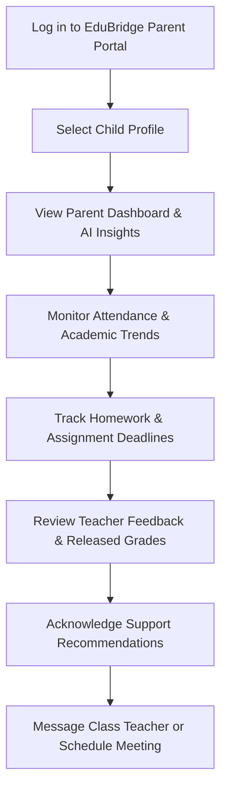

# EduBridge — Parent / Guardian Functional Requirements Specification (SRS) & Detailed Implementation Guide

**Document Path**: `backend/docs/School/Docs/Parent/parent_details.md`  
**Target Actor**: Parent / Guardian (`PARENT`)  
**Scope**: Complete Functional Requirement Specification, Architecture Contracts, Cross-Actor Dependencies, Database Schema Mappings, API Specifications, AI Boundary Rules, and Operational Workflow for the Parent / Guardian Actor in EduBridge.

---

## 0. Role Definition

The **Parent / Guardian** is a support, monitoring, engagement, and advisory actor in the EduBridge ecosystem.

The central question for this actor is:
> **“How is my child doing academically and operationally, and how can I support their learning journey today?”**

The SRS explicitly defines this actor as responsible for monitoring student growth, communicating with authorized teachers, confirming support interventions, and participating in school activities, while official educational records remain controlled by authorized school personnel.

### Key Structural & Operational Bounding
- **Scope**: Restricted to children officially linked to the parent account (`ParentStudent` relationship).
- **Authorization Scope**: Access bounded strictly to verified child connections (`connectionStatus = VERIFIED`).
- **Primary Responsibility**: Monitor → Communicate → Support → Respond → Participate.

---

## 1. Parent Dashboard

### Purpose
The dashboard is the Parent's central command center. It answers:
> **“What is the status of my child’s attendance, grades, pending assignments, and school alerts today?”**

### Functional Requirements
The dashboard shall display:
1. **Linked Children Switcher**: Allow parents with multiple children (e.g., *Hana — Grade 10A*, *Abel — Grade 7B*) to toggle seamlessly between child profiles.
2. **Attendance Summary**: Display attendance percentage, total present, absent, late, and unexcused absence counters.
3. **Academic Performance Overview**: Subject score averages, overall performance trend indicators ($\uparrow$ Improving, $\rightarrow$ Stable, $\downarrow$ Declining), and class standing.
4. **Upcoming Activities & Deadlines**: List upcoming tests, project due dates, and homework assignments.
5. **Alerts & Warnings**: Highlight immediate concerns (e.g., unexplained absence today, grade drops below threshold, new teacher feedback).
6. **Support & Intervention Status**: Display active remedial recommendations or scheduled tutorial sessions.
7. **AI Parent Insights**: Render personalized summaries explaining child progress and recommended home support strategies.

---

## 2. Child Profile & Official Connection

### Purpose
View verified administrative connection details for linked children.

### Must Cover
The parent shall be able to view:
- **Child Metadata**: Name, Student ID code, date of birth.
- **School Information**: Enrolled school name, campus details.
- **Academic Placement**: Current Grade, Section, and active Academic Year.
- **Relationship Type**: Verified relationship status (`Mother`, `Father`, `Guardian`, `Primary Contact`).
- **Connection Status**: Track verification state (`PENDING_VERIFICATION`, `VERIFIED`, `REJECTED`, `SUSPENDED`).

### Important Boundary
- Parents **cannot** self-assign an unverified child to their account.
- The school administration must validate and verify all `ParentStudent` linkage requests before data access is granted.

---

## 3. Attendance Monitoring & Alerts

### Purpose
Track the child's daily school attendance and receive real-time notifications for unexpected absences.

### Functional Requirements
- **Attendance Records**: Display detailed breakdown of `PRESENT`, `ABSENT`, `LATE`, and `EXCUSED` days.
- **Attendance History**: Filter historical attendance by date range or specific subject period.
- **Attendance Percentage**: Calculate overall percentage against school attendance requirements.
- **Automated Absence Alerts**: Trigger real-time notifications when a child is marked absent or late (e.g., *"Hana was marked absent for Period 1 today"*).
- **Chronic Absence Warnings**: Alert parent if monthly unexplained absences exceed school monitoring thresholds.

### Boundary
- Parents **cannot** directly edit or overwrite attendance records.

---

## 4. Academic Performance & Assessment Results

### Purpose
Monitor academic growth across subjects and review approved test scores.

### Functional Requirements
- **Subject Scores**: View individual subject averages, term grades, and historical trends.
- **Assessment Results**: Access scores for released quizzes, midterms, final exams, projects, and practical tests.
- **Teacher Feedback**: Read qualitative teacher remarks attached to assessment results (`StudentResult.feedback`).
- **Performance Trends**: Visualize performance trajectory over terms ($\uparrow$ Improving, $\rightarrow$ Stable, $\downarrow$ Declining).
- **Strengths & Growth Areas**: View subject areas where the child excels or requires additional practice.

### Boundary
- Only assessment results **released** by authorized school personnel shall be visible to parents.

---

## 5. Learning Activities & Assignment Monitoring

### Purpose
Track homework, project deadlines, and submission completeness.

### Functional Requirements
- **Upcoming Assignments**: View list of assigned homework, reading tasks, and lab reports.
- **Due Dates & Deadlines**: Track target submission due dates and countdowns.
- **Submission Status**: Verify whether the child submitted work on time (`PENDING`, `SUBMITTED`, `LATE`, `GRADED`).
- **Assignment Grades**: View scores and teacher comments on returned assignments.
- **Parent Learning Guidance**: Access suggestions on how to assist with homework without completing work for the child.

---

## 6. Student Support & Interventions

### Purpose
Stay informed and participate when the school recommends academic or behavioral intervention.

### Functional Requirements
- **Support Notifications**: Receive alerts when a `SupportFlag` is raised (`ACADEMIC`, `BEHAVIORAL`, `ATTENDANCE`, `MEDICAL`).
- **Tutorial Schedules**: View scheduled remedial or enrichment sessions (date, time, room, instructor).
- **Parent Response**: Acknowledge support recommendations, confirm attendance, or request clarification.
- **Intervention Outcomes**: Track pre- and post-intervention progress to measure improvement.

---

## 7. Communication & Parent-Teacher Meetings

### Purpose
Engage directly with authorized teachers and school leadership.

### Functional Requirements
- **Teacher Messages**: 1-on-1 messaging with teachers currently assigned to the child's section.
- **School Announcements**: Receive school-wide notices, exam schedules, and holiday announcements.
- **Parent-Teacher Meetings**:
  - View available consultation time slots.
  - Propose or accept parent-teacher meeting invitations.
  - Receive meeting reminders.
- **Distinction**: Clear UI distinction between *School Announcements*, *Teacher Messages*, and *System Notifications*.

---

## 8. Consent, Confirmation & Feedback

### Purpose
Provide formal parent consent for school activities and submit feedback or concerns.

### Functional Requirements
- **Activity Consent**: Submit digital confirmation/consent for field trips, club activities, or school events.
- **Contact Information Updates**: Request updates to phone numbers, emails, emergency contacts, or home addresses.
- **School Feedback**: Provide feedback on school facilities, teaching, or communication.
- **Concern Submission**: Submit academic or student welfare concerns, which are automatically routed to the responsible school role.

---

## 9. AI Parent Assistant

### Purpose
Controlled decision support and personalized progress explanation for parents.

### Functional Requirements
The AI Parent Assistant shall help with:
1. **Progress Explanation**: Translate grade trends and attendance metrics into clear, supportive explanations.
2. **Teacher Feedback Interpretation**: Summarize teacher comments into actionable insights.
3. **Home Learning Support**: Suggest age-appropriate home practice strategies based on current subject focus.

### ⚠️ AI Safety & Boundary Rules
The AI Assistant is strictly **advisory**. The AI shall **NEVER**:
- Diagnose learning disabilities or make medical/psychological assertions.
- Make official academic judgments or grade projections.
- Expose unauthorized internal school notes or unreleased grades.

---

## 10. Data Privacy & Access Boundaries

The parent shall **only** access data for their officially connected children.

The parent shall **NOT** see:
- Another student's scores, attendance, or personal details.
- Other parents' contact information.
- Private internal teacher notes.
- Regional, Woreda, or Federal administrative statistics.

---

## 11. Critical Cross-Cutting Requirements

### A. Authorization & Connection Verification
- Every API endpoint serving parent data must verify `ParentStudent` linkage where `connectionStatus = VERIFIED`.
- Attempting to access data for an unlinked student must fail with `403 Forbidden`.

### B. Source of Truth Discipline
- Parent dashboards reflect operational evidence generated naturally by normal school activities.
- No dummy data or hardcoded mock scores shall exist in production code.

### C. Historical Preservation
- Historical attendance logs, assessment results, and term averages are preserved permanently across academic years.

---

## 12. What the Parent Must NOT Control

The Parent shall **NOT**:
1. Change grades or examination results.
2. Change student attendance records.
3. Alter student enrollment status or section placement.
4. Assign teachers or alter subject curricula.
5. Create official school assessments.
6. Approve official student grade promotions or graduations.

---

## 13. The Actual Parent Workflow

---

## 14. Prisma Schema Mapping (`backend/prisma/schema.prisma`)

| Model Name | Table Name | Purpose for Parent Actor |
| :--- | :--- | :--- |
| `Parent` | `parent` | Parent identity record (`firstName`, `lastName`, `phoneNumber`, `userId`). |
| `ParentStudent` | `parent_student` | Binds `Parent` to `Student` (`relationship`, `isPrimary`, `canPickup`). |
| `Student` | `student` | Student identity record (`firstName`, `lastName`, `studentId`). |
| `StudentEnrollment` | `student_enrollment` | Active placement in Grade, Section, and Academic Year. |
| `StudentAttendance` | `student_attendance` | Child's daily/period attendance records (`PRESENT`, `ABSENT`, `LATE`). |
| `StudentResult` | `student_result` | Child's test scores & teacher feedback. |
| `Assessment` | `assessment` | Exam/quiz metadata (`title`, `type`, `maxScore`, `dueDate`). |
| `Submission` | `submission` | Child's assignment submission status & grades. |
| `SupportFlag` | `support_flag` | Support flags raised for the child. |
| `Announcement` | `announcement` | Broadcast school notices. |
| `Message` | `message` | 1-on-1 parent-teacher messages. |

---

## 15. Complete API Contract Summary

All Parent endpoints are registered across `backend/src/modules/parent/parent.routes.ts` with complete `@openapi` Swagger documentation:

| Method | Route | Subdomain Module | Purpose / Action | Required Scope & Permission |
| :--- | :--- | :--- | :--- | :--- |
| `GET` | `/api/parent/me` | `parent` | Fetch logged-in parent profile & verified connected children | Authenticated Parent (`SCHOOL`) |
| `GET` | `/api/parent/dashboard-summary` | `parent` | Live command center summary for selected child (attendance, grades, alerts, AI insights) | Authenticated Parent (`SCHOOL`) |
| `GET` | `/api/parent/children` | `parent` | List linked children & verification statuses (`ParentStudent`) | Authenticated Parent (`SCHOOL`) |
| `POST` | `/api/parent/link-student` | `parent` | Request linking a student to the parent account | Authenticated Parent (`SCHOOL`) |
| `GET` | `/api/parent/child/:studentId/attendance` | `attendance` | View child's attendance history, percentage, & absence alerts | Authenticated Parent (`SCHOOL`) |
| `GET` | `/api/parent/child/:studentId/academic` | `assessment` | View child's subject averages, score trends, & strengths | Authenticated Parent (`SCHOOL`) |
| `GET` | `/api/parent/child/:studentId/assessments` | `assessment` | View released quiz/exam scores & teacher feedback | Authenticated Parent (`SCHOOL`) |
| `GET` | `/api/parent/child/:studentId/activities` | `learning` | Monitor homework assignments, due dates, & submission statuses | Authenticated Parent (`SCHOOL`) |
| `GET` | `/api/parent/child/:studentId/support` | `learning` | View active support flags & scheduled tutorial sessions | Authenticated Parent (`SCHOOL`) |
| `POST` | `/api/parent/support/response` | `learning` | Acknowledge support recommendation or confirm participation | Authenticated Parent (`SCHOOL`) |
| `GET` | `/api/parent/messages` | `communication` | Fetch 1-on-1 messages with child's teachers | Authenticated Parent (`SCHOOL`) |
| `POST` | `/api/parent/messages` | `communication` | Send message to an authorized teacher of the child | Authenticated Parent (`SCHOOL`) |
| `POST` | `/api/parent/meetings` | `communication` | Request or schedule a parent-teacher meeting | Authenticated Parent (`SCHOOL`) |
| `GET` | `/api/parent/meetings` | `communication` | List scheduled parent-teacher meetings & statuses | Authenticated Parent (`SCHOOL`) |
| `GET` | `/api/parent/announcements` | `communication` | Fetch school notices relevant to child's grade/section | Authenticated Parent (`SCHOOL`) |
| `POST` | `/api/parent/consent` | `parent` | Submit digital activity consent or event confirmation | Authenticated Parent (`SCHOOL`) |
| `POST` | `/api/parent/concerns` | `parent` | Submit academic or student welfare concern to school leadership | Authenticated Parent (`SCHOOL`) |
