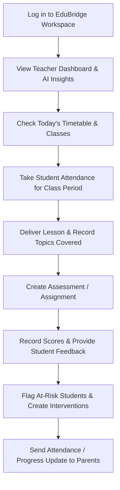

# EduBridge — Teacher Functional Requirements Specification (SRS) & Detailed Implementation Guide

**Document Path**: `backend/docs/School/Docs/Teacher/teacher_details.md`  
**Target Actor**: Teacher (`TEACHER`)  
**Scope**: Complete Functional Requirement Specification, Architecture Contracts, Cross-Actor Dependencies, Database Schema Mappings, API Specifications, AI Boundary Rules, and Operational Workflow for the Teacher Actor in EduBridge.

---

## 0. Role Definition

The **Teacher** is the primary classroom-level instructional, learning-management, and operational role in EduBridge.

The central question for this actor is:
> **“What is happening in my teaching, classes, and students today, and what requires my immediate educational attention?”**

The SRS explicitly defines this actor as responsible primarily for classroom instruction, student assessment, attendance recording, learning activity management, student support flagging, and parent/student communication. 

### Key Structural & Operational Bounding
- **Scope**: Strictly bounded to the Teacher’s assigned **School** (`OrganizationUnit` with `type = SCHOOL`).
- **Authorization Scope**: Restricted to subjects, grades, sections, and student rosters for which the teacher holds an active `TeachingAssignment`.
- **Primary Responsibility**: Teach → Manage Learning → Record Evidence → Assess → Identify Problems → Support Students → Communicate → Improve Teaching.

---

## 1. Teacher Dashboard

### Purpose
The dashboard is the Teacher’s daily operational command center. It answers:
> **“What classes am I teaching today, which tasks are pending, and which students need my help right now?”**

### Functional Requirements
The dashboard shall display:
1. **Today's Classes**: Real-time list of class periods scheduled for the current date based on day of week (`dayOfWeek`).
2. **Today's Timetable**: Period start/end times, subject name, grade/section, assigned room, and student headcount.
3. **Students Overview**: Total active student headcount assigned across all sections taught by the teacher.
4. **Attendance Tasks**: Highlight scheduled classes today where student attendance has not yet been submitted.
5. **Pending Assessments**: List of created tests, exams, or quizzes requiring score entry or grade finalization.
6. **Pending Assignments**: Submitted student work (`Submission` with status `SUBMITTED`) awaiting teacher review and feedback.
7. **Students Requiring Attention**: High-risk student warnings generated by active `SupportFlag` items (Academic, Attendance, Behavioral) or attendance rates below 80%.
8. **AI Teaching Insights**: AI-generated daily teaching summaries, automated performance anomaly warnings, and prioritized daily action checklists.

### Drill-down Capabilities
The dashboard shall allow the teacher to drill down into:
- **Subject**: View detailed subject curriculum and assigned section performance.
- **Grade & Section**: View full student rosters, section averages, and attendance percentages.
- **Student**: View individual student academic profiles, attendance history, score trends, and support logs.

---

## 2. My Teaching Assignments

### Purpose
The teacher views their official academic load assigned by school leadership.

### Must Cover
The teacher shall be able to view:
- **Subjects**: Assigned teaching subjects (`Subject.name`, `Subject.code`).
- **Grades**: Target grade levels (`SchoolGrade.level`).
- **Sections**: Specific section designations (`Section.name`, e.g., Grade 9A).
- **Classes**: Combined Subject + Section roster definitions.
- **Teaching Schedule**: Period distribution and weekly teaching load.

### Important Boundary
- Teachers **do not** self-assign official teaching duties.
- School leadership (School Administrator / Vice Principal) assigns:
  $$\text{Teacher} \longrightarrow \text{Subject} \longrightarrow \text{Grade} \longrightarrow \text{Section}$$
- EduBridge consumes these assignments to automatically scope the teacher's access boundary.

---

## 3. Student Management

### Purpose
The teacher manages the academic and operational profiles of students in their assigned classes.

### Functional Requirements
The teacher shall be able to:
- **View Assigned Students**: Search and filter students belonging exclusively to their assigned section rosters.
- **View Student Profiles**: Inspect student name, student ID code, gender, and basic enrollment details.
- **View Student Attendance**: Inspect individual student historical attendance records.
- **View Student Performance**: View score trends across quizzes, exams, and continuous assessments.
- **View Student Learning History**: Inspect past assignment submissions, completion rates, and historical support flags.

### Authorization Boundary
- The teacher shall **only** view student records for students currently enrolled in sections taught by that teacher. Cross-school or unassigned student access is strictly prohibited.

---

## 4. Student Attendance

### Purpose
Taking attendance is a core daily operational responsibility of the teacher.

### Functional Requirements
The teacher shall be able to:
- **Take Student Attendance**: Open class section roster for a date/period and mark status (`PRESENT`, `ABSENT`, `LATE`, `EXCUSED`).
- **View Attendance History**: Access historical attendance logs filtered by date, section, or student.
- **Record Absence Reason**: Add optional teacher notes explaining documented or authorized absences.
- **Identify Repeated Absence**: View calculated absence counts and highlight chronic absenteeism patterns.
- **Report Attendance Problems**: Escalate severe non-attendance to Vice Principal or School Counselor.

### Traceability & Corrections
- Attendance entries locked after the permitted correction window cannot be overwritten directly.
- The teacher must submit an **Attendance Correction Request** detailing the reason, preserving a full audit trail (`AuditLog`).

---

## 5. Lesson & Curriculum Progress

### Purpose
The teacher tracks the actual delivery of curriculum in the classroom.

### Functional Requirements
The teacher shall be able to:
- **View Curriculum**: Access approved syllabus units, topics, and expected competencies for assigned subjects.
- **Record Lesson Progress**: Log conducted lesson entries (`Class` $\rightarrow$ `Subject` $\rightarrow$ `Topic` $\rightarrow$ `Date`).
- **Record Topics Covered**: Mark official curriculum topics/units as completed.
- **Track Curriculum Progress**: Compare expected curriculum pace against actual progress.
- **Record Learning Difficulties**: Document observed class-wide conceptual difficulties.
- **Record Teaching Notes**: Maintain optional teaching reflections and lesson notes.

---

## 6. Assessment & Grading

### Purpose
The teacher creates evaluations, records scores, and provides qualitative feedback.

### Functional Requirements
The teacher shall be able to:
- **Create Assessment**: Define evaluation items (`title`, `type`, `maxScore`, `passingScore`, `dueDate`, `teachingAssignmentId`).
- **Assessment Types**: Support `EXAM`, `QUIZ`, `ASSIGNMENT`, `PROJECT`, `OTHER`.
- **Conduct Assessment**: Track test administration dates and guidelines.
- **Record Results**: Input numerical scores per enrolled student (`StudentResult.score`).
- **Grade Students**: View pass/fail distribution and percentage performance.
- **Provide Feedback**: Attach qualitative remarks per student result (`StudentResult.feedback`).

---

## 7. Learning Activities & Assignments

### Purpose
The teacher assigns, collects, and evaluates student coursework.

### Functional Requirements
The teacher shall be able to:
- **Create Activity**: Post coursework (`HOMEWORK`, `READING`, `LAB`, `PRACTICE`).
- **Set Deadline**: Define target submission due dates (`dueDate`).
- **Review Submissions**: Inspect student submitted work (`contentUrl`, submission timestamp).
- **Mark Completion & Feedback**: Assign activity status (`PENDING`, `SUBMITTED`, `GRADED`) with teacher feedback.
- **Track Non-Completion**: Automatically list students who failed to submit assignments by the due date.

---

## 8. Student Support & Interventions

### Purpose
The teacher identifies struggling or advanced students and initiates academic support.

### Functional Requirements
The teacher shall be able to:
- **Identify Learning Difficulty**: Detect declining performance or learning hurdles.
- **Flag Student for Support**: Raise `SupportFlag` (`ACADEMIC`, `BEHAVIORAL`, `ATTENDANCE`, `MEDICAL`, `OTHER`).
- **Create Remedial / Enrichment Activity**: Assign custom catch-up or advanced practice tasks.
- **Create & Monitor Intervention**: Document intervention dates, strategies, and track post-intervention outcomes.
- **Record Outcome**: Document whether support flags were resolved (`resolvedAt`, `resolution`).

---

## 9. Parent Communication

### Purpose
The teacher engages parents on student academic and behavioral progress.

### Functional Requirements
The teacher shall be able to:
- **Send Parent Message**: Communicate directly with verified parents/guardians of assigned students.
- **Attendance Notifications**: Send automated or manual alerts regarding student absences/lateness.
- **Performance Notifications**: Notify parents of significant test results or grade drops.
- **Request Parent Meeting**: Propose face-to-face or digital consultation meetings.
- **Provide Teacher Feedback**: Share qualitative behavioral or academic observations.

### Privacy Boundary
- Communication must remain strictly 1-on-1 between the teacher and the specific student's guardian. Cross-student data exposure is strictly prohibited.

---

## 10. Teacher Communication

### Purpose
The teacher receives institutional announcements and participates in staff coordination.

### Functional Requirements
The teacher shall be able to:
- **School Announcements**: View official school-wide notices broadcasted by administration.
- **Academic & Department Communication**: Engage in subject-department discussions and staff announcements.

---

## 11. Professional Development

### Purpose
The teacher engages in continuous professional growth.

### Functional Requirements
The teacher shall be able to:
- **View & Join Training**: Browse available professional development workshops.
- **Track Training Progress**: Monitor participation and view completion certificates.

---

## 12. Teacher Reports

### Purpose
The teacher generates operational reports for their assigned classes.

### Functional Requirements
The teacher shall be able to generate/view:
- **Class Attendance Report**: Monthly section attendance percentages and absence logs.
- **Assessment & Grade Report**: Test score averages, grade distributions, and class means.
- **Student Performance Report**: Individual student academic growth trends.
- **Assignment Completion Report**: Homework submission rates per section.
- **Curriculum Progress Report**: Topic completion percentage against the academic calendar.
- **Intervention Progress Report**: Pre- and post-intervention score comparisons.

---

## 13. AI Teacher Assistant

### Purpose
Decision support and teaching preparation assistance.

### Functional Requirements
The AI Assistant shall help with:
1. **Teaching Preparation**: Draft lesson plans, suggest classroom activities, generate discussion prompts, and adapt explanations.
2. **Assessment Assistance**: Generate draft quiz questions, practice problem variations, and analyze commonly missed test areas.
3. **Student Support**: Identify students needing academic attention, explain score drop patterns, and suggest remedial/enrichment activities.
4. **Administrative Help**: Summarize class attendance trends and draft parent message templates.

### ⚠️ AI Safety & Boundary Rules
The AI Assistant is strictly **advisory**. The AI shall **NEVER**:
- Automatically change student grades.
- Automatically modify attendance records.
- Promote or fail students.
- Change official database records.
- Make disciplinary decisions.

---

## 14. Data Correction & Auditability

### Functional Requirements
The teacher shall be able to:
- Request correction of locked attendance or finalized assessment records.
- Provide a mandatory justification reason for every correction request.
- View request status (`PENDING`, `APPROVED`, `REJECTED`).
- All approved corrections must maintain a permanent `AuditLog` entry detailing old value, new value, timestamp, and authorizing user ID.

---

## 15. Critical Cross-Cutting Requirements

### A. Authorization & Scope Isolation
- The teacher shall **only** operate on their authorized school (`OrganizationUnitType = SCHOOL`).
- `GET /api/teacher/students` or `GET /api/teacher/my-classes` must fail with `403 Forbidden` if an unassigned class or external school ID is requested.

### B. Source of Truth Discipline
- Data is generated naturally through daily teaching activities (taking attendance, entering test scores, posting assignments).
- No fake API data or mock JSON responses shall exist in production code.

### C. Historical Preservation
- Changing academic years or section assignments shall **never** overwrite or delete historical attendance, assessment results, or student status logs.

---

## 16. What the Teacher Must NOT Do

The Teacher shall **NOT**:
1. Manage or modify school-wide settings or organization profiles.
2. Self-assign official teaching assignments or subjects.
3. Modify another teacher's class assignments, attendance, or grades.
4. View student data outside their assigned teaching sections.
5. View confidential regional, zone, or national MoE statistics.
6. Modify national curriculum standards.
7. Approve official student grade promotions or graduations independently.
8. Modify permissions or manage system user roles.

---

## 17. The Actual Teacher Workflow

---

## 18. Prisma Schema & API Contract Summary

### Database Models (`backend/prisma/schema.prisma`)
- `Teacher`, `TeachingAssignment`, `StudentEnrollment`, `Timetable`, `ClassPeriod`, `StudentAttendance`, `Assessment`, `StudentResult`, `LearningActivity`, `Submission`, `SupportFlag`, `Issue`.

### Complete API Contract Summary

All Teacher endpoints are registered across `backend/src/modules/` with complete `@openapi` Swagger documentation:

| Method | Route | Subdomain Module | Purpose / Action | Required Scope & Permission |
| :--- | :--- | :--- | :--- | :--- |
| `GET` | `/api/teacher/me` | `teacher` | Fetch logged-in teacher profile & active assignments | Authenticated Teacher (`SCHOOL`) |
| `GET` | `/api/teacher/dashboard-summary` | `teacher` | Live command center metrics, today's schedule, pending tasks, & AI insights | Authenticated Teacher (`SCHOOL`) |
| `GET` | `/api/teacher/my-classes` | `teacher` | Fetch assigned classes, subjects, and section student rosters | Authenticated Teacher (`SCHOOL`) |
| `GET` | `/api/teacher/my-timetable` | `teacher` | Fetch weekly period schedule for logged-in teacher | Authenticated Teacher (`SCHOOL`) |
| `GET` | `/api/teacher/students` | `teacher` | Fetch student profiles & performance across assigned sections | Authenticated Teacher (`SCHOOL`) |
| `POST` | `/api/teacher/issues` | `teacher` | Report classroom, material, or facility obstacle to administration | Authenticated Teacher (`SCHOOL`) |
| `GET` | `/api/teacher/issues` | `teacher` | Fetch reported obstacle status & resolution history | Authenticated Teacher (`SCHOOL`) |
| `GET` | `/api/teacher` | `teacher` | Directory list of all school teachers | `ACADEMIC:VIEW` (`SCHOOL`) |
| `POST` | `/api/teacher` | `teacher` | Create a new teacher profile in the school | `ACADEMIC:CREATE` (`SCHOOL`) |
| `GET` | `/api/teacher/assignments` | `teacher` | List all teaching assignments in the school | `ACADEMIC:VIEW` (`SCHOOL`) |
| `POST` | `/api/teacher/assignments` | `teacher` | Assign a teacher to Subject + Grade + Section | `ACADEMIC:CREATE` (`SCHOOL`) |
| `POST` | `/api/attendance/student` | `attendance` | Record student attendance (`PRESENT`, `ABSENT`, `LATE`, `EXCUSED`) | `ACADEMIC:CREATE` (`SCHOOL`) |
| `GET` | `/api/attendance/student/:id` | `attendance` | Fetch attendance history for a student | `ACADEMIC:VIEW` (`SCHOOL`) |
| `POST` | `/api/assessment` | `assessment` | Create an assessment (`EXAM`, `QUIZ`, `ASSIGNMENT`, `PROJECT`) | `ACADEMIC:CREATE` (`SCHOOL`) |
| `GET` | `/api/assessment` | `assessment` | List assessments for school or specific teaching assignment | `ACADEMIC:VIEW` (`SCHOOL`) |
| `POST` | `/api/assessment/result` | `assessment` | Record student score & qualitative teacher feedback | `ACADEMIC:CREATE` (`SCHOOL`) |
| `GET` | `/api/assessment/result/student/:id` | `assessment` | Fetch student assessment score history | `ACADEMIC:VIEW` (`SCHOOL`) |
| `POST` | `/api/learning/activity` | `learning` | Create a learning activity (`HOMEWORK`, `READING`, `LAB`, `PRACTICE`) | `ACADEMIC:CREATE` (`SCHOOL`) |
| `GET` | `/api/learning/activity` | `learning` | List learning activities for school/assignment | `ACADEMIC:VIEW` (`SCHOOL`) |
| `POST` | `/api/learning/submission` | `learning` | Submit or grade learning activity response | `ACADEMIC:CREATE` (`SCHOOL`) |
| `POST` | `/api/learning/support` | `learning` | Raise a support flag for an at-risk student (`SupportFlag`) | `ACADEMIC:CREATE` (`SCHOOL`) |
| `GET` | `/api/learning/support` | `learning` | List support flags for school or specific student | `ACADEMIC:VIEW` (`SCHOOL`) |
| `GET` | `/api/timetable/teacher/:id` | `timetable` | Fetch weekly timetable for a specific teacher ID | `ACADEMIC:VIEW` (`SCHOOL`) |
