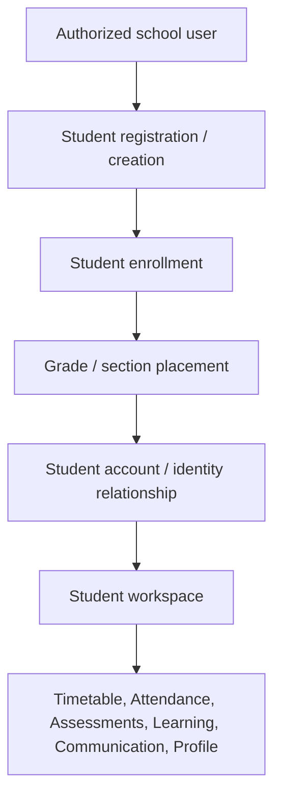
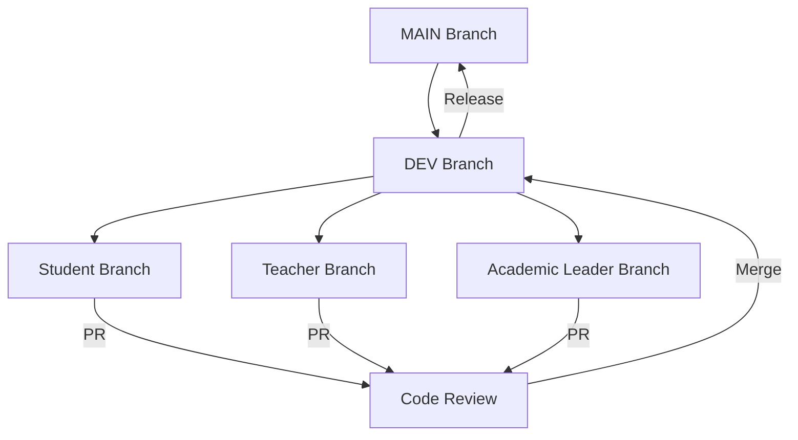

# EduBridge Actor Team Assignment & Parallel Implementation Plan

## Objective

We have completed and tested the **Shared School Backend Foundation**.

The foundation is the common infrastructure on which all actor-specific functionality must now be built.

We will now divide development into three independent actor teams:

1. **Student Actor**
2. **Teacher Actor**
3. **Vice Principal / Academic Leader Actor**

Each developer/team is responsible for implementing the **complete workflow of their assigned actor**, including all necessary backend APIs, business logic, database changes when required, frontend UI, authorization, tests, and Swagger documentation.

The three teams must work independently on separate Git branches while continuously building on the shared foundation in `main`.

---

# 1. IMPORTANT ARCHITECTURAL RULE

The foundation is NOT the final Student, Teacher, or Academic Leader application.

The foundation provides shared capabilities such as:

* Authentication
* Users
* Roles
* Permissions
* School scope
* Organization
* Academic years
* Grades
* Sections
* Subjects
* Students
* Enrollment
* Teachers
* Teaching assignments
* Timetable
* Attendance
* Assessment
* Learning
* Parents
* Communication
* Operations
* Audit/history
* Validation
* Pagination
* Error handling
* Swagger

Actor developers must now build the **real workflows and experiences** that use these shared capabilities.

Do NOT duplicate foundation functionality unnecessarily.

Before adding a new model/API, determine whether the foundation already provides it.

---

# 2. REQUIRED DOCUMENT REVIEW BEFORE CODING

Before implementing anything, each developer MUST inspect the repository and understand the existing architecture.

Read:

### Shared requirements

* SRS
* School-domain documentation
* Actor definitions
* Listed actor features
* Existing architecture documentation
* Existing API documentation
* Existing Swagger documentation
* Existing database schema
* Existing foundation implementation status
* Existing frontend architecture/design
* Existing authentication implementation
* Existing authorization implementation

### Student developer must additionally study

`backend/docs/school/student`

and all Student-specific documents, requirements, workflows, use cases, and listed features.

### Teacher developer must additionally study

`backend/docs/school/teacher`

and all Teacher-specific documents, requirements, workflows, use cases, and listed features.

### Vice Principal / Academic Leader developer must additionally study

the relevant Academic Leader / Vice Principal documentation under the school-domain documentation and all related SRS requirements.

> [!WARNING]
> Do not invent requirements that are not supported by the project's documents. If a requirement is ambiguous, identify it before implementation instead of silently inventing behavior.

---

# 3. GIT WORKFLOW — MANDATORY

Every developer must follow this workflow.

Before starting:

```bash
git checkout dev
git pull origin dev
```

Then create a meaningful branch. Examples:

```bash
git checkout -b feature/student-actor
git checkout -b feature/teacher-actor
git checkout -b feature/academic-leader-actor
```

> [!IMPORTANT]
> Never work directly on `main` or `dev`.

Before every major implementation phase:

```bash
git checkout dev
git pull origin dev
```

Then rebase/merge the latest dev changes into the feature branch as appropriate.

Use meaningful commits. Examples:

```text
feat(student): implement student profile workflow
feat(student): implement student enrollment workflow
feat(teacher): implement teacher workspace
feat(academic): implement academic leader dashboard
fix(student): correct enrollment authorization
test(teacher): add teacher attendance workflow tests
```

Do NOT create meaningless commits such as `update`, `changes`, `stuff`, `fix`, `test`, `done`.

When the assigned work is complete:
1. Push the branch.
2. Create a Pull Request.
3. Clearly describe:
   * What was implemented.
   * Backend changes.
   * Frontend changes.
   * Database changes.
   * APIs added/changed.
   * Tests.
   * Swagger changes.
   * Any migration.
   * Any known limitations.

Do not merge your own work without review.

---

# 4. SHARED FOUNDATION RULE

The existing foundation is the source of truth.

Before implementing a feature:
1. Find the existing backend API.
2. Inspect its controller, service, and Prisma model.
3. Inspect its authorization and Swagger documentation.
4. Determine whether it already satisfies the actor requirement.
5. Reuse it if possible.
6. Extend it only if the actor requirement genuinely needs additional behavior.

Do not create duplicate endpoints such as `/student/create`, `/student/register`, `/student/admin-create`, `/student/new` when an existing foundation API already provides the required operation. Extend the existing architecture instead.

---

# 5. CRITICAL DISTINCTION: ACTOR VS ADMINISTRATION

An actor developer is responsible for the **complete actor workflow**, not only the actor's personal dashboard.

For example, the Student developer must understand that student records may need to be created/enrolled by an authorized school administrator or registrar before a student can use the Student workspace. Therefore the Student developer must implement the complete Student lifecycle required by the SRS:



The student actor does NOT necessarily perform every administrative action themselves. The developer owns the **whole workflow**, including the administrative side required to make the Student actor functional. The same principle applies to Teacher and Academic Leader.

---

# 6. STUDENT ACTOR TEAM

The Student developer owns the complete Student domain experience. Study the existing Student foundation first, then implement all Student requirements from the SRS and `backend/docs/school/student`.

The implementation should cover, where required by the project's documents:

### Student administrative lifecycle
* Student registration, profile, and identity
* Enrollment, Grade/Section placement
* Student status, transfer, and history
* Parent relationship and student account relationship
* Any required approval workflow

### Student self-service
Build the Student workspace using real backend data. Examples:
* Student dashboard and profile
* My timetable, attendance, assessments/results, assignments
* My learning activities, submissions, and support information
* Announcements, notifications, and messages

### Authorization
A student must only access data belonging to that student. Never expose another student's profile, attendance, results, assignments, submissions, or support information. Test these boundaries.

### Backend & Frontend
Add/extend APIs only when the foundation does not satisfy the documented Student requirement. Build the complete Student UI using the existing design system and visual language. Do not create a separate unrelated UI style.

---

# 7. TEACHER ACTOR TEAM

The Teacher developer owns the complete Teacher workflow. Study `backend/docs/school/teacher` and all Teacher requirements.

### Teacher administration
Where required:
* Teacher profile, staff identity, and account relationship
* Teaching, subject, grade, and section assignments
* Workload and teacher status
* Required administrative workflows

### Teacher workspace
Build the Teacher application around the teacher's assigned data. Examples:
* Teacher dashboard and profile
* My classes, subjects, and assignments
* My timetable and student attendance
* Assessment creation and grade/result entry
* Learning activities, assignment creation, and submission review
* Feedback, student support flags
* Announcements, notifications, and communication

Teacher data must be restricted to the teacher's authorized school and assigned academic context. A teacher must not automatically see unrelated teachers, classes, schools, or students.

---

# 8. VICE PRINCIPAL / ACADEMIC LEADER TEAM

The Vice Principal / Academic Leader developer owns the complete academic-management workflow. This actor should NOT simply receive a copy of the Admin dashboard.

Implement the required academic leadership workflows. Potential areas include only those supported by the project requirements:

### Academic oversight
* Academic dashboard, year monitoring, calendar, and periods
* Grades, sections, subjects, and school subjects
* Teacher assignments and timetable oversight
* Attendance, assessment, and student academic performance monitoring
* Learning/support monitoring, academic reports
* Academic announcements, tasks/actions, and intervention/improvement workflows

> [!WARNING]
> The Academic Leader must receive only the permissions defined by the project's authorization model. Do not give the Vice Principal unrestricted Admin privileges simply because they need to monitor academic operations. Implement proper RBAC.

---

# 9. FRONTEND RULES FOR ALL THREE TEAMS

All actor frontends must use the existing EduBridge frontend architecture. Reuse Layout, Sidebar, Header, Typography, Colors, Buttons, Forms, Tables, Cards, Modals, Loading states, Error states, Empty states, Notifications, Authentication, Organization context, and API client.

Do not create three unrelated design systems. The applications should clearly feel like the same EduBridge product.

---

# 10. REAL BACKEND DATA ONLY

Never hardcode production-like data (e.g. `Students: 120`). Every dashboard and feature must follow:
`Browser → Next.js → Authentication → API client → Backend → Database → Real data`

No fake API responses. No fake JSON. No hardcoded records. No temporary mock implementation left behind.

---

# 11. TESTING REQUIREMENT

Each developer must test their complete actor workflow, including:
* **Authentication**: unauthenticated vs authenticated requests
* **Authorization**: correct role, incorrect role, incorrect school, incorrect organization scope, unauthorized resource
* **Validation**: missing/invalid fields, invalid IDs, invalid state transitions
* **Business logic**: valid/invalid workflows, duplicate operations, historical records, status transitions
* **Frontend**: loading, success, empty state, validation error, server error, unauthorized state
* **Integration**: Verify `Frontend → API → Database → response → UI`

---

# 12. SWAGGER REQUIREMENT

Every newly created or modified API must be documented using the existing Swagger architecture. Do NOT create a second Swagger system. Every API should automatically appear in `/api/docs`. Verify the newly added endpoint appears there.

---

# 13. DATABASE RULE

Before modifying Prisma:
1. Inspect the existing schema.
2. Determine whether the model already exists.
3. Reuse existing relationships and avoid duplicate models.
4. Preserve historical data and existing foundation functionality.
5. Add migrations safely, regenerate Prisma client, and run tests.

Do not casually change foundation constraints because they make actor development easier.

---

# 14. TEST USER REQUIREMENT

Each actor developer may create/use dedicated development test users. The developer must use the existing authentication system. Do not bypass Better Auth. Do not hardcode authentication inside the frontend.

If an actor requires an Admin operation during development, create/use a legitimate Admin test account through the project's existing authentication/seed mechanism.

---

# 15. PARALLEL DEVELOPMENT RULE

These teams are intentionally independent. Each developer must minimize unnecessary changes outside their actor domain. If a developer discovers that another actor needs a shared foundation change, document it and coordinate before modifying another team's domain.

### Expected Architecture:



---

# 16. CROSS-ACTOR DEPENDENCIES

Before starting implementation, each team must produce a short dependency map. Examples:

* **Student**: User/Auth, School, Academic Year, Grade, Section, Enrollment, Teacher, Attendance, Assessment, Learning, Parent, Communication
* **Teacher**: User/Auth, School, Academic Year, Grade, Section, Subject, Teaching Assignment, Timetable, Attendance, Assessment, Learning, Communication
* **Academic Leader**: User/Auth, School, Academic Year, Grades, Sections, Subjects, Teachers, Timetable, Attendance, Assessment, Learning/Support, Operational/Communication

---

# 17. DO NOT START CODING IMMEDIATELY

First perform a **read-only analysis**. For the assigned actor:
1. Read all relevant documentation and inspect the current stack (backend, frontend, Prisma, auth, Swagger, tests).
2. Map existing APIs to actor requirements and identify missing pieces (APIs, DB functionality, UI, dependencies).
3. Identify possible conflicts with other developers.

Then produce an **Actor Implementation Readiness Report** including:
* Existing capabilities & APIs to reuse
* Missing backend/frontend functionality to build
* Required Authorization, DB changes, Tests, and Swagger updates
* Cross-actor dependencies and parallel-development risks
* Implementation phases

WAIT FOR APPROVAL.

---

# 18. IMPLEMENTATION MODE

After the readiness report is reviewed, implementation must proceed one phase at a time. After completing each phase:
1. Check tests, TypeScript, Prisma, API behavior, Swagger, frontend, and authorization.
2. Verify no regression in the foundation.
3. Update documentation/status and report exactly what changed.
4. STOP and wait for `CONTINUE` before beginning the next phase.

Never implement all actor features in one uncontrolled operation.

---

# 19. FINAL ACCEPTANCE CRITERIA

An actor is considered complete only when:
- [ ] All documented actor requirements are implemented.
- [ ] Backend and Frontend workflows work using real database data.
- [ ] Authentication, authorization, and school scope isolation work.
- [ ] Validation, error handling, and historical behavior are correct.
- [ ] Swagger is updated and all tests pass (including existing foundation tests).
- [ ] UI is consistent with EduBridge.
- [ ] No unnecessary duplicate APIs or fake data exist.
- [ ] Git history contains meaningful commits.
- [ ] PR is created and clearly documents all changes.

---

# FIRST ACTION

Do NOT write code yet.

First determine which actor this branch is assigned to (Student, Teacher, Vice Principal / Academic Leader). Then read all relevant project documents and the existing implementation.

Produce the **Actor Implementation Readiness Report** described above.

STOP and wait for approval before implementation.
